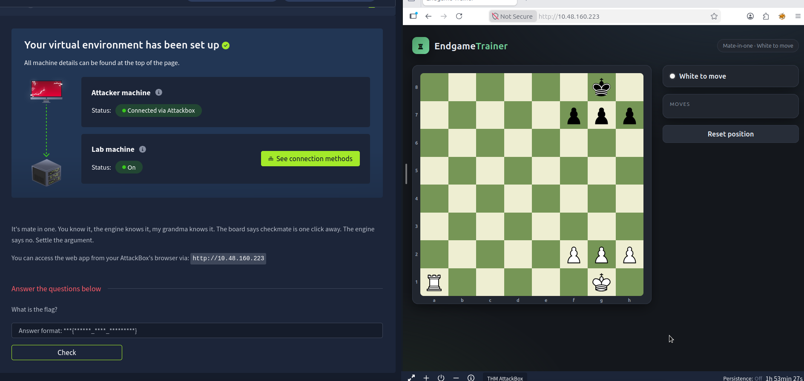
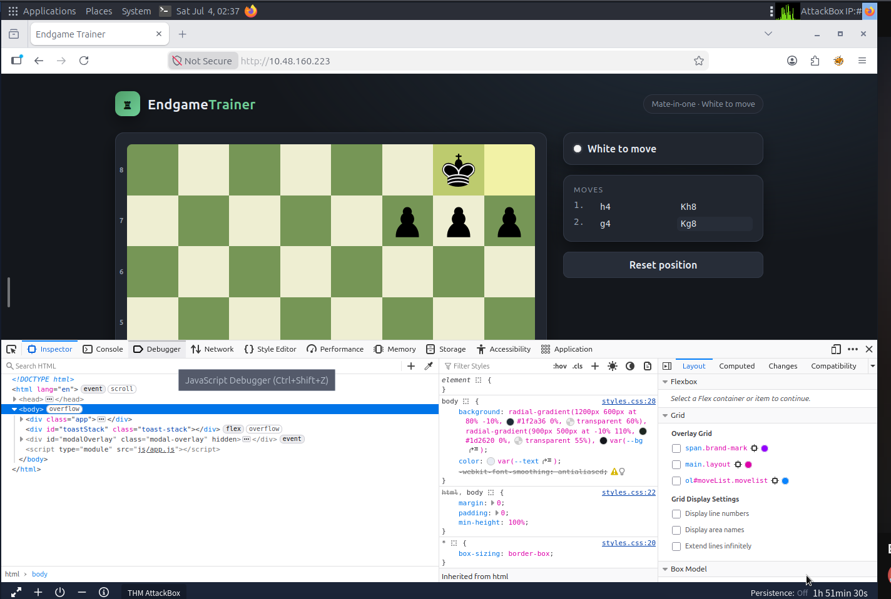
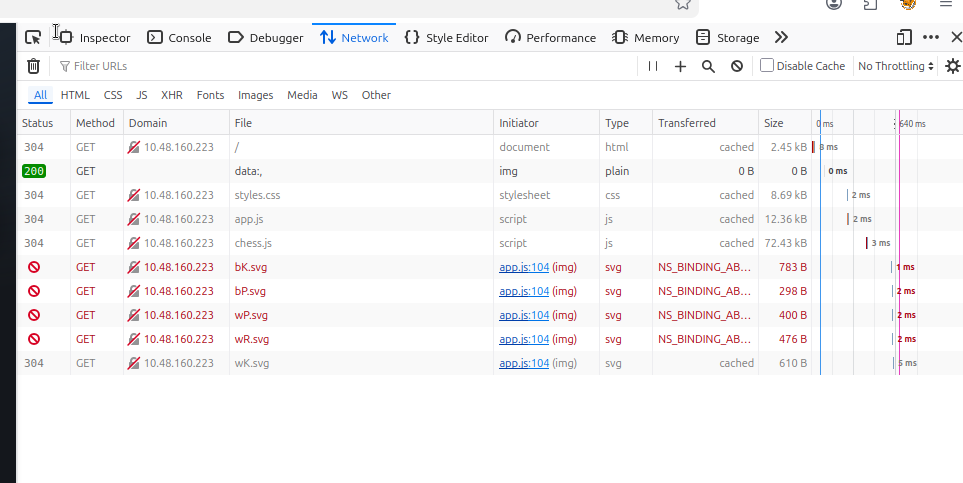
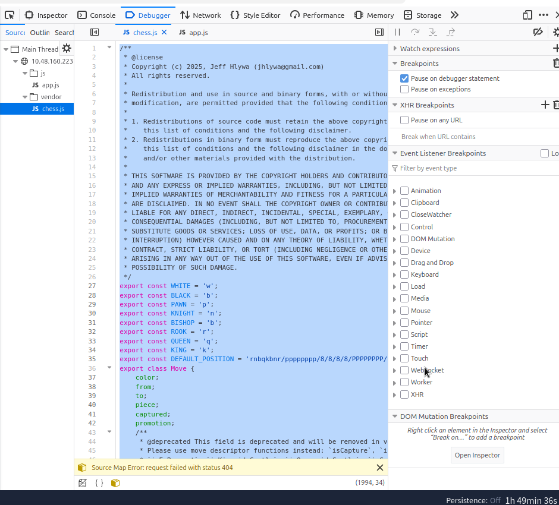
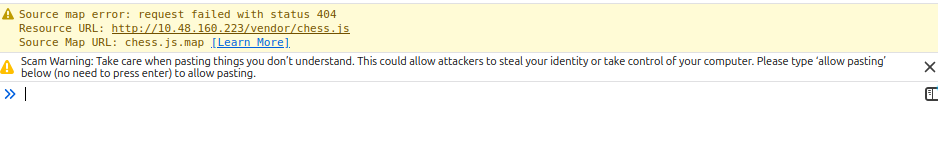
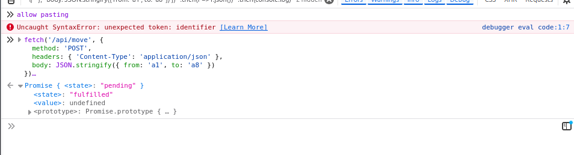
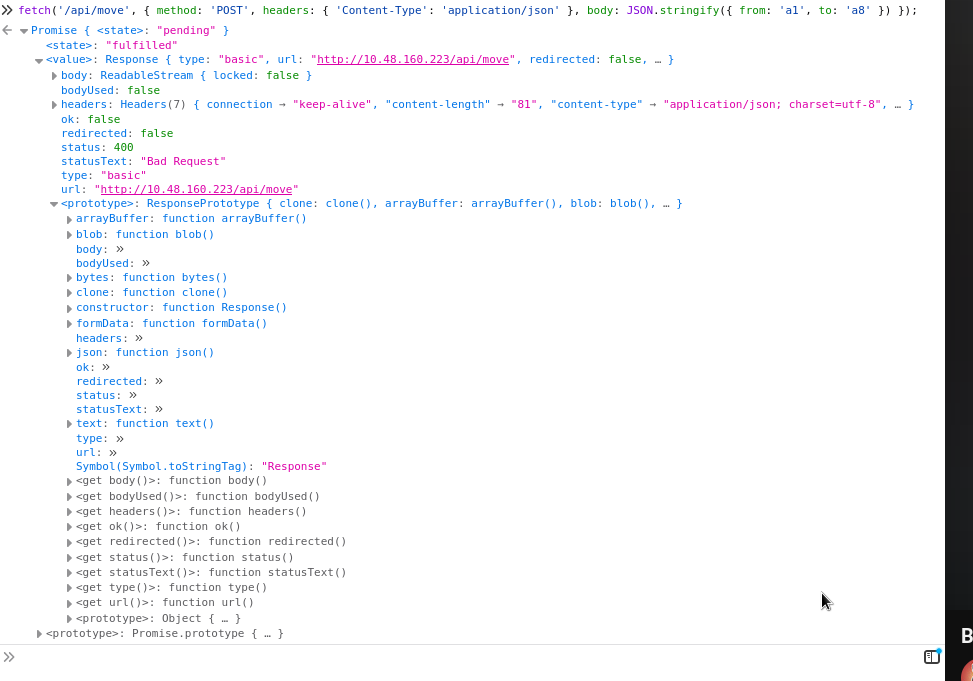
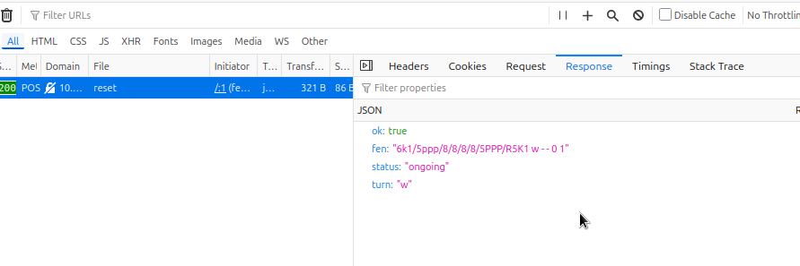
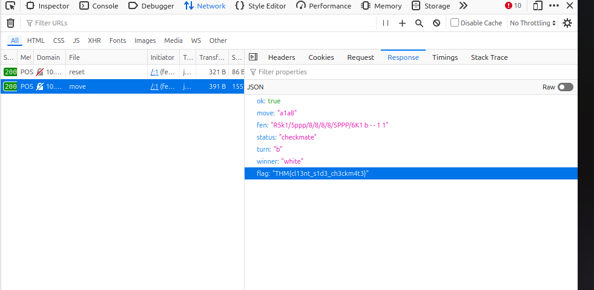

# Fools Mate (Web / Client-Side Logic Bug)

**Category:** Web exploitation / client-side trust bug
**Difficulty:** Easy
**Tools used:** Firefox DevTools (Inspector, Debugger, Network, Console)

## The setup

The room description is basically a dare:

> It's mate in one. You know it, the engine knows it, my grandma knows it. The board says checkmate is one click away. The engine says no. Settle the argument.

You get handed a URL (`http://10.48.160.223`) to a little web app called **EndgameTrainer**. It loads a chess position, tells you it's mate in one, White to move, and gives you an interactive board to play it on.



The position was `6k1/5ppp/8/8/8/8/5PPP/R5K1 w - - 0 1` — white rook on a1, white king on g1, black king on g8 boxed in by its own pawns on f7/g7/h7. That's about as textbook a back-rank mate as chess has: `Ra1-a8#`. Rook slides all the way up the open a-file to a8, checks the king along the 8th rank, and there's no escape square because the king's own pawns are blocking every flight square and nothing can block or capture the rook.

So the chess part of this "puzzle" took about four seconds to solve. The actual puzzle was: why does the app refuse to accept that move?

## First pass: is this a chess bug or a detection bug?

Before touching any code, I wanted to rule out the boring explanation — maybe I was wrong about the position, or maybe there was some UI quirk with how moves get entered. So I actually played around on the board a bit first, which is visible in the move list here (this was just me testing, not the actual solution):



Those `h4`/`Kh8`, `g4`/`Kg8` moves are just me poking at the UI to see how it behaved — not part of the solve. What mattered more was confirming there was no obvious "this move is illegal" UI error, and that the app was clearly capable of accepting *some* moves. So the bug had to be specific to what happens right around the checkmating move itself.

## Checking whether this is client-only or hits a backend

Next question: is the "no" coming from a server doing its own (broken) validation, or is it purely a client-side JS decision? I opened the **Network** tab, cleared it, and reset the position to get a clean baseline of what requests the page actually makes on load:



At this point, nothing but static assets (`app.js`, `chess.js`, some SVG piece images, a couple 403'd icon requests that don't matter). No XHR/fetch traffic at all. That told me two things: first, that any move-rejection logic was probably going to be in one of those two JS files, and second — this became relevant later — that the app *does* eventually talk to a backend (`/api/move`, `/api/reset`), it just doesn't fire on page load.

## Reading the source

I switched to the **Debugger** tab and pulled up both scripts. `chess.js` turned out to be the well-known open-source [chess.js library by Jeff Hlywa](https://github.com/jhlywa/chess.js) — full legal move generation, FEN parsing, checkmate/stalemate detection, the works. At 72KB versus `app.js`'s 12KB, it was pretty clearly the "trusted" engine underneath, and not where a homebrewed bug would live.



So I went through `app.js` instead, since that's the thin wrapper this specific challenge actually wrote. A few functions stood out immediately: `doMove()`, `sendMove()`, and one called `preMoveCheck()`. That last name was suspicious enough on its own — why would you need a "pre-move check" on top of a full chess engine that already validates legality?

Here's the function that turned out to be the entire challenge:

```js
function preMoveCheck(from, to, promotion) {
  const probe = new Chess(game.fen());
  let result;
  try {
    result = probe.move({ from, to, promotion: promotion || undefined });
  } catch (e) {
    result = null;
  }
  if (result && probe.isCheckmate()) {
    showSystemNotice("I'll shut down your PC if you play that.");
    return false;
  }
  return true;
}
```

And here's how it's wired into the actual move-handling flow:

```js
function doMove(from, to) {
  if (!isLegalTarget(from, to)) return false;
  const promotion = needsPromotion(from, to) ? 'q' : undefined;
  if (!preMoveCheck(from, to, promotion)) {
    setElPos(els[from], from, true);
    return true;
  }
  toast(SMUG[Math.floor(Math.random() * SMUG.length)]);
  sendMove(from, to, promotion);
  return true;
}
```

Read that carefully and the whole gag is right there: before the app ever sends your move to the server, it clones the current board into a throwaway `Chess` instance, simulates your move on that clone, and asks the (perfectly correct) chess.js library whether that hypothetical move would be checkmate. If the answer is yes, it just... refuses to send the real move. It snaps the piece back to where it started and pops up a joke threat instead ("I'll shut down your PC if you play that.").

The chess engine was never wrong. It was being asked the right question and giving the right answer — the app just wasn't listening to it when the answer was inconvenient. The actual bug (or rather, the intentional design of the challenge) is that **all of this validation happens entirely in the browser**, and the real move only ever gets sent to the server via `sendMove()`, which is a plain `fetch()` call:

```js
async function sendMove(from, to, promotion) {
  const res = await fetch('/api/move', {
    method: 'POST',
    headers: { 'Content-Type': 'application/json' },
    body: JSON.stringify({ from, to, promotion: promotion || undefined })
  });
  ...
}
```

Nothing stops me from calling that same endpoint myself, directly from the console, completely skipping `preMoveCheck()`.

## Getting the console to cooperate (the annoying part)

This should have been the easy part — just paste a `fetch()` call into the console — but I hit a string of small, very "real debugging session" annoyances that are worth documenting honestly rather than glossing over.

**First attempt** — pasted a multi-line `fetch(...).then(...).then(...)` block straight in. Firefox blocked it with its anti-self-XSS paste warning:



That sourcemap 404 above it is unrelated — just the browser failing to fetch `chess.js.map`, which doesn't exist on this server. Harmless, ignore it.

Typed `allow pasting` as instructed, then pasted the snippet again — and got a syntax error:



Turns out Firefox's console was executing the pasted lines somewhat independently, which broke apart my chained `.then()` calls mid-statement. The fix was trivial: collapse the whole thing onto one line so there was no ambiguity about where the statement ended.

Even after that fixed the syntax error, I still couldn't get a clean readable response out of `console.log()` — the console kept printing the pending `Promise` object itself (which is what the `fetch()` expression evaluates to) rather than showing me the resolved value in an obviously readable spot. I tried `await`, I tried assigning to a `window` variable, and honestly none of it mattered in the end because there was a much more reliable place to look the whole time: **the Network tab**, which shows you the actual request and response regardless of how badly the console is behaving.

## Using the Network tab instead

Went back to a clean approach: fire the fetch call (ignore what the console prints), then just click on the resulting request in the Network tab and read its Response directly.

**First real attempt**, `a1 → a8` on whatever state the board happened to be in:



`400 Bad Request`. Made sense in hindsight — I'd been testing other moves earlier (the h4/g4 stuff from the beginning), so the actual server-side board state had drifted away from the starting position. The move `a1a8` was being validated against whatever position the server currently thought we were in, not the fresh puzzle position.

Fixed that by hitting `/api/reset` first and reading its response to confirm the board was back to square one:



```json
{
  "ok": true,
  "fen": "6k1/5ppp/8/8/8/8/5PPP/R5K1 w - - 0 1",
  "status": "ongoing",
  "turn": "w"
}
```

Exactly the starting position. Good — now the board was in a known-clean state matching what the challenge intended.

## Sending the winning move directly to the backend

With the board confirmed clean, I sent the real request, completely bypassing `preMoveCheck()` and the whole client-side veto:

```js
fetch('/api/move', {
  method: 'POST',
  headers: { 'Content-Type': 'application/json' },
  body: JSON.stringify({ from: 'a1', to: 'a8' })
});
```

Clicked into that request in the Network tab and checked the Response:



```json
{
  "ok": true,
  "move": "a1a8",
  "fen": "R5k1/5ppp/8/8/8/8/5PPP/6K1 b - - 1 1",
  "status": "checkmate",
  "turn": "b",
  "winner": "white",
  "flag": "THM{cl13nt_s1d3_ch3ckm4t3}"
}
```

`status: checkmate`, `winner: white`, and the flag sitting right there in the response body. Server-side logic — using the exact same chess.js library the client had access to the whole time — correctly validated the move and declared the win. It was never a chess engine problem. The server was right all along; the browser was just lying to me about what the server would say.

**Flag: `THM{cl13nt_s1d3_ch3ckm4t3}`**

## What the flag name is actually pointing at

`cl13nt_s1d3_ch3ckm4t3` → "client side checkmate" — which is a pretty clean summary of the entire bug class this room is teaching: **never trust client-side validation as the actual security or business-logic boundary.** The client can refuse to submit a move, gray out a button, hide a form field, or throw a fake error message — none of that matters if the real decision is (or should be) enforced server-side, because anyone with DevTools open can just skip the client and talk to the API directly.

In this specific case the app actually did the right thing on the backend — the server's own move validation and checkmate detection were correct the entire time. The only "vulnerability" was that the developer added an extra, entirely pointless client-side veto on top of a system that didn't need one, and that veto was trivially bypassable because it lived in JavaScript running in a browser I fully control.

The general lesson generalizes way beyond chess: form validation that blocks a "disallowed" value, a "Buy" button that's disabled until some client-side condition is met, a price calculation done in JS before a purchase request is sent — all of these are the same shape of bug. If the enforcement only happens in code the attacker can read, step through, and route around, it isn't enforcement. It's a suggestion.

## Recap of the actual solve steps

1. Confirmed the chess: `Ra1-a8#` is a legal, immediate checkmate on the given FEN.
2. Confirmed no backend calls happen on page load — ruled out server round-trips as the source of the block, initially.
3. Read `app.js` in the Debugger and found `preMoveCheck()`, which simulates the move locally with a real chess.js instance and refuses to call `sendMove()` if the simulated result is checkmate.
4. Identified that the real backend call (`fetch('/api/move', ...)`) is a plain, unauthenticated POST that the client-side code merely chooses not to make — nothing stops calling it directly.
5. Reset the board server-side via `/api/reset` to get back to the puzzle's starting FEN.
6. Called `/api/move` directly from the console with `{ from: 'a1', to: 'a8' }`, bypassing the client entirely.
7. Server responded with `status: "checkmate"`, `winner: "white"`, and the flag.
